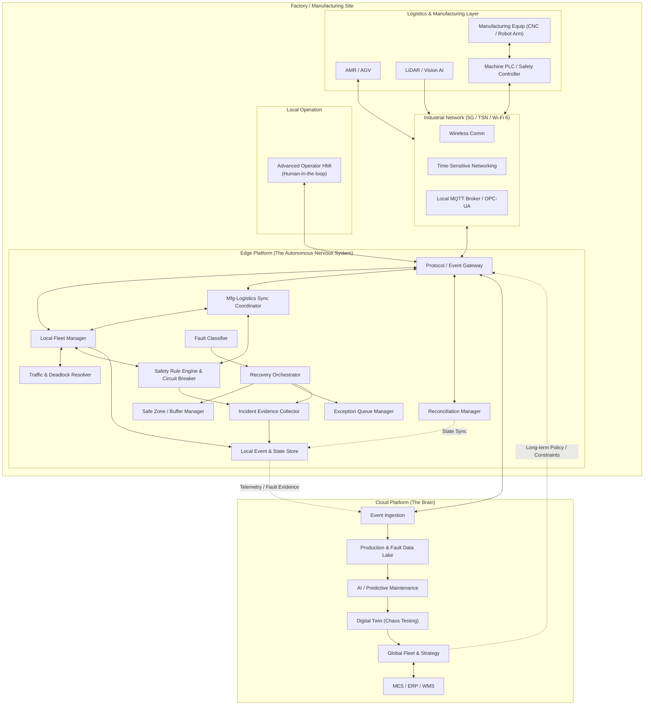

# 제조-물류 통합 Edge-Cloud 아키텍처 및 장애 대응 설계안

제조 설비(Equipment)와 물류(Logistics) 시스템 간의 유기적 연결은 공장 리드타임 단축과 생산성 향상을 위해 필수적입니다. AMR/AGV의 이동 제어를 단순히 물류 관점에서만 보는 것이 아니라, 실제 제조 라인의 생산 상태와 연동하여 전체 시스템의 가동률을 높이는 것이 본 설계의 핵심입니다.

본 설계안은 클라우드 중심의 관리 체계와 엣지 중심의 실시간 제어를 분리하고, 현장 장애 발생 시에도 시스템의 연속성을 보장하기 위한 복원력(Resilience) 확보 방안을 다룹니다.

---

## 1. 제조-물류 오케스트레이션 설계 방향

기존의 단방향 작업 하달 방식에서 벗어나, 현장 상황에 기민하게 반응하는 제어 구조를 지향합니다.

### 1) 설비-물류 간 직결 제어 (M2M Handshake)
AMR이 설비에 도착했을 때 클라우드를 거치지 않고 Edge 내에서 설비 PLC와 직접 상호작용하도록 설계합니다. 이를 통해 네트워크 지연을 최소화하고 상보적인 작업 타이밍을 확보합니다.

### 2) 설비 상태 기반 물류 제어
설비의 '부품 대기(Starving)' 또는 '배출 적체(Blocked)' 상태를 실시간으로 파악하여 미션의 우선순위를 조정합니다. 물류 차량의 효율보다 제조 라인의 무중단 운영을 최우선 목표로 둡니다.

---

## 2. 확장된 논리 아키텍처 (제조 설비 융합)



### 엣지 플랫폼의 핵심 가용성(Resilience) 컴포넌트 정의
*   **Mfg-Logistics Sync Coordinator (`SyncCoord`)**: 설비의 생산 주기와 AMR의 물류 주기를 0.1초 단위로 동기화합니다.
*   **Fault Classifier (`FaultClass`)**: 수집된 텔레메트리와 이벤트를 분석하여 장애 종류(Safety-critical, Production-critical, Traffic-critical 등)를 실시간으로 분류합니다.
*   **Recovery Orchestrator (`RecOrch`)**: 분류된 장애 등급에 따라 '운영 모드 상태 머신'을 구동하고 격리, 우회, 복구 시나리오를 정밀하게 오케스트레이션합니다.
*   **Safe Zone / Buffer Manager (`SafeZone`)**: 장애 발생 시 인근 주행 중인 AMR이 신속하게 대피할 수 있는 최적의 안전 대기 구역(Safe Point) 및 충전 구역, 유지보수 베이(Bay)를 동적으로 배정합니다.
*   **Exception Queue Manager (`ExQueue`)**: 장애 구역에 묶여 수행이 불가능해진 미션들을 임시 보류(Held), 타 로봇 이양(Transferred), 혹은 취소(Cancelled) 처리하고, 예외 큐를 관리하여 복구 시 지연 없이 작업을 재개시킵니다.
*   **Reconciliation Manager (`Reconcile`)**: 에지-클라우드 간의 네트워크 단절 발생 시 로컬 트랜잭션을 버퍼링하고, 연결 복구 시 충돌을 감지·해소하여 최종 데이터 정합성을 보장합니다.
*   **Incident Evidence Collector (`Evidence`)**: 장애 발생 직전의 센서 데이터, PLC 상태값, 제어 명령 이력 등을 블랙박스 형태로 보존하여 사후 원인 분석(Root Cause Analysis)을 위한 분석 플랫폼에 업로드합니다.

---

## 3. 시스템 복원력 및 장애 대응 설계

본 설계의 장애 대응은 단순한 에러 복구를 넘어, **NIST SP 800-82**, **ISA/IEC 62443**, **ISA-95** 규격을 준수하는 '운영 모드 전환 시스템'으로 정의됩니다. 안전(Safety)을 최우선으로 하며, 생산 연속성을 보장하기 위한 다층적 복원 체계를 구축합니다.

### 3.1. 장애 대응 5대 원칙 (Safety-First)
현업의 안전 요구사항(**ISO 3691-4**)에 따라 다음과 같은 우선순위를 적용합니다.
1.  **인명 안전(Human Safety)**: 사람이 다칠 가능성이 있는 모든 상황에서 최우선 정지.
2.  **설비 보호**: 로봇과 설비 간 충돌 방지 및 설비 고장 확산 차단.
3.  **병목 확산 방지(Isolation)**: 장애 구역을 격리하여 타 구역 생산 중단 방지.
4.  **데이터 정합성(Consistency)**: 단절 시에도 MES/WMS와 에지 간 상태 불일치 최소화.
5.  **운영자 개입 관측성**: 모든 자동 복구 시도를 기록하고 필요 시 제어권을 인간에게 이양.

#### [안전 제어 주체의 4단계 우선순위 계층]
장애 발생 및 위급 상황 시 제어 권한의 판단은 아래와 같은 엄격한 계층 구조를 따릅니다.
*   **1순위 (최우선) - AMR/AGV 자체 안전 제어**: 차량 내부의 안전 레이저 스캐너, 범퍼 센서 및 물리적 안전 제어기(Safety Controller)에 기반한 즉각적인 정지. 상위 소프트웨어 장애 여부와 무관하게 동작합니다.
*   **2순위 - Edge Safety Rule Engine**: 엣지 플랫폼 단에서 처리되는 구역별 속도 제한, 위험 구역 진입 제어, 교차로 진입 방지 인터락 등 협업 안전을 보장하는 동적 제어.
*   **3순위 - 현장 Operator HMI (Manual Override)**: 현장 운영자가 HMI 웹 콘솔 또는 물리 펜던트를 통해 직접 차량을 정지시키거나 강제로 우회·격리 조치하는 수동 명령.
*   **4순위 - Cloud 정책**: 원격 분석에 근거한 장기적인 우회 경로 설계, 작업 최적화 정책 변경 등. 실시간 안전과는 분리되어 동작합니다.

### 3.2. 운영 모드 상태 머신
장애 심각도에 따라 시스템은 다음 모드 중 하나로 즉시 전환됩니다.

*   **NORMAL**: 모든 시스템 정상 작동.
*   **CAUTION**: 위험 징후(네트워크 지연, 정체 예상) 감지 시 감속 및 감시 강화.
*   **DEGRADED**: 일부 비-안전 관련 보조 센서 품질 저하, 특정 경로 지연 등 **통제 가능한 위험** 상황에서 속도를 수동 제한(예: 최대 속도의 20% 주행)하여 자동 운영을 계속 유지함.
*   **ISOLATED**: 특정 구역 차단 및 외부 진입 금지.
*   **LOCAL_ONLY**: 클라우드 단절 시 에지 독자 제어권 보유.
*   **SAFE_STOP**: 메인 Safety Scanner 불능, 비상 정지(E-Stop) 감지, 위치 소실 등 **위험 판단이 불가능한 상황**에서 즉시 주행을 강제 중단하고 안전 PLC와 연동하여 물리 정지 상태로 전환함. (수동 리셋 및 운영자 개입 필수)
*   **RECOVERING**: 복구 확인 후 제한적 재개(Half-Open) 및 검증 단계.

> [!NOTE]
> **DEGRADED 모드와 SAFE_STOP 모드의 핵심 차이**
> *   **DEGRADED 모드**는 생산성 저하를 감수하고라도 **시스템 주도의 자동 주행을 유지**하여 라인의 가동 중단을 방지하는 것이 목표입니다.
> *   **SAFE_STOP 모드**는 추가 사고를 막기 위해 **자동 운영을 전면 중단**하고 사람 혹은 설비 안전 루프의 수동 리셋(Manual Reset)이 완료될 때까지 차량을 완전히 잠금(Lock) 처리합니다.

### 3.3. 6대 장애 대응 루프 (Response Loops)
시스템은 각 계층별로 독립적인 대응 루프를 가집니다.
1.  **Safety Loop**: 안전 PLC/센서 직결 제어. 애플리케이션 장애와 무관하게 즉시 정지 보장.
2.  **Traffic Loop**: 경로 차단, 우회 경로 예약, 교착 상태 해소.
3.  **Production Loop**: 설비 상태(Starving/Blocked) 기반 실시간 미션 우선순위 재분배.
4.  **Connectivity Loop**: 네트워크 품질 저하 시 트래픽 등급화(QoS) 및 단절 대응.
5.  **Data Consistency Loop**: 단절 후 재연결 시 상태 보정(Reconciliation).
6.  **Human Recovery Loop**: 운영자 승인 및 수동 조치 가이드 제공.

### 3.4. 현업 시나리오별 대응 매트릭스

| 장애 유형 | 감지 및 판단 기준 | 즉시 조치 및 운영 모드 | 복구 조건 (Normal 복귀) |
| :--- | :--- | :--- | :--- |
| **설비 Jam / FAULT** | PLC 신호, 버퍼 적체 감지 | 구역 Lock, AMR 우회/대피 (**ISOLATED**) | FAULT 해제, 설비 정상 Cycle 확인 |
| **PLC 통신 두절** | Heartbeat Timeout | 상태 UNKNOWN 처리, 접근 차단 (**DEGRADED**) | 통신 복구 후 안전 인터락 확인 |
| **LiDAR 품질 저하** | Frame Drop, 신뢰도 하락 | 속도 제한, 위험 구역 회피 (**DEGRADED**) | 센서 Self-test 통과 |
| **안전 센서 불능** | Safety Scanner FAULT | 즉시 물리적 정지 (**SAFE_STOP**) | 정비자 점검 및 수동 Reset |
| **통로 정차(Stall)** | 위치 변화 없음 | 해당 Segment 차단, 후속 AMR 우회 (**ISOLATED**) | 로봇 이동 또는 수동 제거 확인 |
| **에지-클라우드 단절** | API/CloudCore 연동 중단 | 에지 현장 제어 위임 (**LOCAL_ONLY**) | 상태 보정(Reconciliation) 완료 |
| **교착(Deadlock)** | Wait-for Graph Cycle 탐지 | 낮은 우선순위 AMR 후퇴/우회 (**DEGRADED**) | Cycle 해소 및 경로 재승인 |
| **보안 이상 명령** | 비정상 Command Rate/인증 실패 | 명령 채널 Read-only 전환 (**SECURITY_DEGRADED**) | 자격 증명 교체 및 원인 파악 |

### 3.5. 규격 기반의 상세 대응 전략

#### 1) OT 보안 및 격리 (ISA/IEC 62443 & NIST SP 800-82)
보안 사고 의심 시 **Defense-in-Depth** 전략에 따라 네트워크를 존(Zone) 단위로 격리합니다. IT망 침해 시에도 OT 제어망(PLC-에지-로봇)의 가용성을 유지하기 위해 제어 토픽을 로컬로 한정하며, 검증되지 않은 외부 명령은 즉시 차단합니다.

#### 2) 클라우드 단절 및 업무 연속성 (ISA-95 Level 3-4)
클라우드(Level 4)와의 연결이 끊겨도 에지(Level 3)는 자동 현장 제어권을 유지합니다.
*   **Pend & Buffer**: 실시간 텔레메트리는 로컬 DB에 버퍼링하고, MES/WMS 확정 처리는 Pending 상태로 유지합니다.
*   **Reconciliation (재연결 시)**: 에지 로컬 로그를 기준으로 클라우드의 만료된 상태(Stale state)를 덮어쓰거나, 충돌 발생 시 운영자 검토로 전환합니다.

#### 3) 단계적 기능 저하 및 안전 정지 (Graceful Degradation)
무조건적인 운행 지속보다 **통제된 성능 저하**를 지향합니다. 장애물 회피 모드에서도 Safety Scanner와 제동 계통이 정상인 범위에서만 제한 주행을 허용하며, 안전 판단이 불가능한 'Unknown-Unknown' 상황에서는 즉시 **Safe Stop**으로 전환하여 운영자 개입을 대기합니다.

---

## 4. Edge와 Cloud의 책임 분리

현장단위 실시간성과 대규모 분석을 양립하기 위해 각 레이어의 책임 분리(Role & Responsibility)를 다음과 같이 설계합니다.

| 구분 | Edge Platform (현장 제어) | Cloud Platform (통합 관리) | 비고 |
| :--- | :--- | :--- | :--- |
| **실시간 차량 제어** | **담당** (10ms 이내 피드백 루프) | **비권장** (네트워크 지연 리스크) | 주행 속도, 방향 제어 등 |
| **충돌 방지 및 안전** | **담당** (안전 PLC 및 센서 연동) | **비권장** (안전 관련 차단) | E-Stop, 보호 필드 속도 감속 등 |
| **교차로 / 교통 제어** | **담당** (Local Traffic Coordinator) | **비권장** (교착 상태 즉시 해소 필요) | 단방향 통로 진입, Lock 획득 등 |
| **작업(Mission) 할당** | **현장 단위 담당** (Local Fleet) | **전체 정책 및 우선순위 수립** | Cloud는 "What" 생성, Edge는 "How" 매핑 |
| **경로 최적화** | **단기 / 실시간 우회** | **장기 / 분석 기반 경로 제안** | 병목 이력 데이터 기반 디지털 트윈 시뮬레이션 |
| **지도 및 라우트** | **로컬 맵 캐시** (실시간 점유) | **마스터 맵 원본 관리** (버전 배포) | 레이아웃 변경 시 Cloud 배포 후 Edge 캐싱 |
| **데이터 저장** | **단기 데이터** (텔레메트리 버퍼, 로컬 상태) | **장기 보존 데이터** (이력, 통계, 골드 데이터) | 단절 시 로컬 보존 후 재연결 시 동기화 |
| **장애 대응 및 격리** | **현장 즉시 격리 및 안전 복구** | **장애 사후 분석 및 최적화** | Edge는 Circuit Breaking, Cloud는 ML 분석 |
| **상위 시스템 연동** | **로컬 연동** (현장 설비 PLC 직접 연동) | **전사 연동** (MES, WMS, ERP 대규모 연동) | 업무 트랜잭션의 최종 확정은 Cloud 중심 |

---

## 5. 통합 상태 모델 설계: 설비-차량-미션의 동기화

단순한 위치 정보 공유를 넘어, 설비와 물류 자산의 상태를 유기적으로 동기화하여 지연 없는 생산을 지원합니다.

*   **설비 상태 (Facility Status)**: `STARVING`(부품 대기), `PROCESSING`(작업 중), `BLOCKED`(배출 대기), `FAULT`(장애), `MAINTENANCE`(정비 중)
*   **미션 및 동기화(Sync) 규칙**:
    *   **공급 최적화**: 설비가 `STARVING` 상태에 진입하기 전, 예상 소요 시간을 계산하여 AMR 파킹 구역 진입 권한(Lock)을 사전에 해제합니다.
    *   **동적 스와핑**: 설비가 `BLOCKED` 상태로 완성품 배출이 지연될 경우, 대기 중인 AMR이 하역 미션을 취소하고 즉시 완성품 회수(Pick) 미션으로 전환하는 동적 스와핑을 자동 실행합니다.
    *   **보호 격리**: 설비 `FAULT` 신호 발생 시, 해당 설비 반경 50m 이내의 모든 AMR 미션을 일시정지(`PAUSED_BY_FACILITY`)하고 즉시 우회 경로(Bypass)를 생성합니다.

---

## 6. 기술 스택 선정 및 검토 결과

현장의 가혹한 요구사항(실시간성, 고가용성, 클라우드 독립 운영)을 충족하기 위한 단계별 기술 검토 결과입니다.

### 6.1. Edge 런타임 및 오케스트레이션
*   **선정 기술**: **K3s (Lightweight Kubernetes)**
*   **검토 내용**:
    *   **Docker Swarm**: 가볍고 직관적이나, 복잡한 상태 관리 및 자동 복구(Auto-healing) 기능이 쿠버네티스 대비 부족합니다.
    *   **KubeEdge**: 클라우드-엣지 통합 관리에 유리하나, 클라우드 의존성(Tightly-coupled)이 높아 네트워크 단절 시 독립 운영 안정성에 리스크가 존재합니다.
    *   **K3s**: 리소스 점유율(512MB 이하 가능)이 낮아 산업용 PC(IPC)에 최적화되어 있으며, 클라우드 연결 없이도 로컬 클러스터의 생존성을 완벽히 보장합니다.

### 6.2. 메시지 브로커 및 실시간 M2M 통신
*   **선정 기술**: **EMQX (MQTT) + Eclipse Milo (OPC-UA)**
*   **검토 내용**:
    *   **Apache Kafka**: 대용량 로깅에는 적합하나, 고지연성(JVM 기반) 문제로 인해 실시간 제어 메시지(10ms 이내) 처리에 부적합합니다.
    *   **RabbitMQ**: 범용적인 큐 관리는 안정적이나, 수천 대의 디바이스가 연결되는 IoT 환경의 확장성 측면에서 MQTT 기반 브로커인 EMQX에 비해 열위에 있습니다.
    *   **EMQX**: Erlang 기반의 고성능 MQTT 브로커로 고가용성 클러스터링을 지원합니다. 여기에 OPC-UA 브릿지인 **Eclipse Milo**를 결합하여 설비 PLC와 차량 간의 즉각적인 통신 환경을 구축합니다.

### 6.3. 데이터 관리 레이어 (Local State Store)
*   **선정 기술**: **Redis (State) + InfluxDB (Telemetry Buffer)**
*   **검토 내용**:
    *   **RDBMS (PostgreSQL)**: 디스크 I/O 병목으로 인해 밀리초 단위로 갱신되는 차량 좌표 및 락(Lock) 데이터를 처리하기에 한계가 있습니다.
    *   **Redis**: 초고속 인메모리 저장소로, 실시간 교통 제어를 위한 초단위 상태 관리에 필수적입니다.
    *   **InfluxDB**: 네트워크 단절 시 클라우드 전송용 측정 데이터(Telemetry)를 로컬에서 안전하게 버퍼링하기 위해 가벼운 시계열 DB를 채택합니다.

### 6.4. 클라우드 분석 플랫폼 및 데이터 분석
*   **선정 기술**: **Azure (AKS, Event Hubs, Azure Data Explorer)**
*   **검토 내용**:
    *   **Azure Data Explorer (ADX)**: 방대한 현장 데이터를 KQL(Kusto Query Language)을 통해 초 단위로 실시간 분석할 수 있습니다. 예를 들어, "최근 30일간 특정 설비 장애 시 주변 AMR의 평균 대기 시간" 등을 즉각적으로 산출하여 디지털 트윈 기반의 라우팅 최적화 기초 데이터로 활용합니다.
    *   **생태계 호환성**: 제조 현장의 주요 시스템(C#/.NET 기반 MES/ERP)과의 높은 호환성을 고려하여 클라우드 환경을 설계했습니다.

---

## 7. 에지 간 제어권 핸드오버(Handover) 상세 설계

AMR이 특정 에지(Edge A)의 관할 구역에서 다른 에지(Edge B)로 이동할 때, 제어 성능 저하나 명령 중첩 없이 권한을 이양하는 프로세스는 물류 안정성의 핵심입니다.

### 7.1. 핸드오버를 위한 기술 계층 구조

#### 1) 로봇 내부 및 저수준 통신 레이어
*   **ROS 2 & DDS**: 로봇 애플리케이션의 기본 프레임워크로, 센서 데이터 처리 및 경로 계획을 담당합니다. DDS(Data Distribution Service)의 **QoS(Reliability, Durability, Deadline, Liveliness, History Depth)** 정책을 활용하여 네트워크 핸드오버 중 발생하는 일시적 단절 상황에서도 통신 신뢰성을 확보하고 Discovery 지연을 최소화합니다.
*   **Zenoh**: 로컬 네트워크 중심인 DDS의 한계를 보완하여 에지-클라우드 간 메시지 라우팅 및 브릿징을 수행합니다. 로봇의 포즈(Pose)와 상태(Mission, Battery, Safety) 정보를 지연 없이 전달하는 통합 통신 인프라 역할을 합니다.

#### 2) 장치-에지 메시징 레이어
*   **MQTT & Sparkplug B**: 산업용 IoT 표준인 Sparkplug B 규격을 적용합니다. 에지 노드와 로봇 장치의 **Birth/Death Certificate(NBIRTH, NDEATH, DBIRTH, DDEATH)** 메커니즘을 통해 장비의 온라인 상태와 메트릭을 표준화된 방식으로 관리하며, 연결 유실 시 즉각적인 상태 인지를 보장합니다.
*   **gRPC**: 에지 간 제어권 이전 및 명령 하달에 사용됩니다. `TransferControl`, `SyncRobotState`, `PrepareHandover`, `CommitHandover`와 같은 고성능 RPC 호출을 통해 핸드오버 절차를 API 레벨에서 정밀하게 오케스트레이션합니다.

### 7.2. 제어권 무결성 및 상호 배제 메커니즘
분산 시스템의 특성상 발생할 수 있는 데이터 정합성 문제와 지연 명령으로 인한 사고를 방지합니다.

*   **Lease 기반 소유권 관리**: 특정 로봇의 제어권(Current Owner)은 일정 시간(TTL) 동안 단 하나의 에지만 보유합니다. 이전 에지의 Lease가 만료되거나 승인된 반납 절차가 완료된 후에만 새로운 에지가 제어권을 가질 수 있습니다.
*   **Fencing Token 및 Sequence Number**: 모든 제어 명령에는 유니크한 토큰과 순번을 부여합니다. 로봇은 현재 보유한 토큰보다 낮은 명령(Old Edge의 지연 명령)이나 이전에 처리한 순번보다 낮거나 같은 명령은 즉시 폐기(Discard)하여 '브레인 스플릿' 현상을 원천 차단합니다.
*   **Distributed Lock & Leader Election**: **etcd, Consul, Redis, ZooKeeper** 등의 분산 잠금 메커니즘을 활용하여 리더 선출을 수행합니다. 로봇 하나당 하나의 '마스터 에지'가 존재함을 보장하며, 클러스터 간 리더 상태를 실시간으로 동기화합니다.
*   **TTL-based Command**: 모든 이동 명령(`MOVE`, `UPDATE_PATH` 등)에 유효 시간(예: 500ms)을 설정하여, 통신 결함으로 뒤늦게 도착한 명령이 부정확한 시점에 실행되는 것을 방지합니다.

### 7.3. 상태 동기화 및 데이터 관리 전략
데이터의 특성(빈도, 일관성 요구 레벨)에 따라 최적의 인프라를 채택합니다.

*   **실시간 텔레메트리 및 세션 (Redis, NATS)**: 고빈도로 발생하는 로봇의 세션 상태, 주행 파라미터, 실시간 위치 데이터를 저장합니다. Redis의 Pub/Sub 기능을 활용해 에지 간 고속 상태 전파를 지원합니다.
*   **강력한 일관성 데이터 (etcd, Consul)**: 제어권 소유 정보(Ownership), 핸드오버 상태 머신, 장치 메타데이터 등 데이터 손실이 허용되지 않는 정보를 관리합니다. Kubernetes Lease API와의 연동을 통해 에지 클러스터 생존성을 보장합니다.
*   **장기 감사 및 이력 보관 (PostgreSQL, Kafka)**: 미션 결과, 제어권 이양 이력, 사고 분석용 감사 로그를 보관합니다. Kafka는 대규모 이벤트 로그의 재처리(Replay)와 분석 플랫폼 연동에 활용됩니다.

### 7.4. 플릿(Fleet) 및 교통 제어 오케스트레이션
*   **Open-RMF (Robotics Middleware Framework)**: 이기종 로봇 플릿 간의 교통 스케줄을 조정합니다. 엘리베이터, 자동문 등 시설 자원과의 연동을 지원하며, 구역 전환 시 이동할 구역의 교통 노드 점유권을 미리 예약하여 경로 충돌과 교착 상태를 방지합니다.
*   **Fleet Adapter**: 실제 로봇 벤더의 API를 Open-RMF 표준 흐름(Task Dispatch, Robot Availability)에 연결하여, 핸드오버 중에도 작업 할당 상태가 중단 없이 전역적으로 동계화되도록 합니다.

### 7.5. 네트워크 이동성 및 에지 오케스트레이션
*   **통신망 핸드오버**: Wi-Fi/5G 인프라 레벨의 핸드오버(802.11r/k/v Fast Roaming 등)와 애플리케이션 핸드오버를 병행 관리합니다. L4 로드밸런서, Anycast VIP, 혹은 서비스 메시 기반 라우팅을 통해 엔드포인트 도달 가능성을 확보합니다.
*   **KubeEdge 기반 관리**: **CloudCore**(클라우드 관리부)와 **EdgeCore**(에지 실행부) 아키텍처를 채택합니다. **DeviceTwin**을 통해 클라우드와 연결이 끊긴 오프라인 상황에서도 에지 노드가 로봇 제어 자율성(Autonomy)을 유지하도록 보장합니다.
*   **클러스터 간 네트워킹**: **Cilium Cluster Mesh, Submariner, Karmada** 등을 활용하여 멀티 클러스터 환경에서의 서비스 디스커버리와 보안 정책을 일관되게 적용합니다.

### 7.6. 관측성 및 모니터링 (Observability)
*   **분산 트레이싱 (OpenTelemetry)**: `PrepareHandover`부터 `CommitHandover`까지의 각 단계를 추적하여 지연 시간(Latency) 및 병목 지점을 진단합니다.
*   **실시간 지표 분석 (Prometheus, Grafana)**: 핸드오버 성공률, 명령 거부율(Rejection Rate), 네트워크 품질 지표를 가시화합니다.
*   **중앙 집중형 로그 수집 (Loki, Fluentd)**: 모든 에지의 핸드오버 트랜잭션 로그를 통합 수집하여 장애 발생 시 사후 원인 분석(Root Cause Analysis)을 지원합니다.

---

## 8. 표준 메시지 모델 스펙 예시

AMR/AGV 제조사별 프로토콜 종속성을 배제하고, 에지-클라우드 간의 유기적 통신 및 정합성 유지를 위해 다음과 같은 정규화된 내부 표준 이벤트 JSON 모델을 정의합니다.

### 8.1. AMR 상태 이벤트 (AMR_STATUS)
차량이 주기적으로(예: 100ms 단위) 엣지 Gateway로 발행하는 실시간 상태 및 세션 텔레메트리 스키마입니다.

```json
{
  "eventType": "AMR_STATUS",
  "siteId": "factory-a",
  "vehicleId": "amr-001",
  "timestamp": "2026-06-06T14:30:00+09:00",
  "position": {
    "x": 12.4,
    "y": 7.8,
    "theta": 90
  },
  "speed": 1.2,
  "battery": 76,
  "status": "MOVING",
  "currentMissionId": "mission-20260606-001",
  "controlLease": {
    "leaseId": 43,
    "ownerEdge": "edge-node-a",
    "ttlMs": 3000
  }
}
```

### 8.2. 작업 지시 이벤트 (MISSION_REQUEST)
클라우드 MES/WMS 및 리드 타임 예측에 기반하여 엣지 플랫폼의 로컬 플릿 매니저로 전달되는 이송 임무 스펙입니다.

```json
{
  "eventType": "MISSION_REQUEST",
  "missionId": "mission-20260606-001",
  "siteId": "factory-a",
  "priority": "HIGH",
  "source": {
    "locationId": "line-3-outfeed",
    "plcInterlockTopic": "plc/line3/outfeed"
  },
  "destination": {
    "locationId": "shipping-area-1",
    "plcInterlockTopic": "plc/shipping1/infeed"
  },
  "payloadType": "pallet",
  "deadline": "2026-06-06T15:00:00+09:00"
}
```

### 8.3. 장애 이벤트 (VEHICLE_FAULT)
에지의 Fault Classifier에 의해 탐지 및 분류되어 Recovery Orchestrator 및 클라우드로 즉시 전파되는 예외 발생 메시지입니다.

```json
{
  "eventType": "VEHICLE_FAULT",
  "siteId": "factory-a",
  "vehicleId": "agv-003",
  "faultCode": "LIDAR_BLOCKED",
  "severity": "CRITICAL",
  "timestamp": "2026-06-06T14:31:00+09:00",
  "currentMissionId": "mission-20260606-002",
  "diagnostics": {
    "lastKnownPose": { "x": 14.5, "y": 9.2 },
    "errorDetail": "Obstacle detected in safety scanner zone for > 5000ms",
    "operatorActionRequired": true
  }
}
```