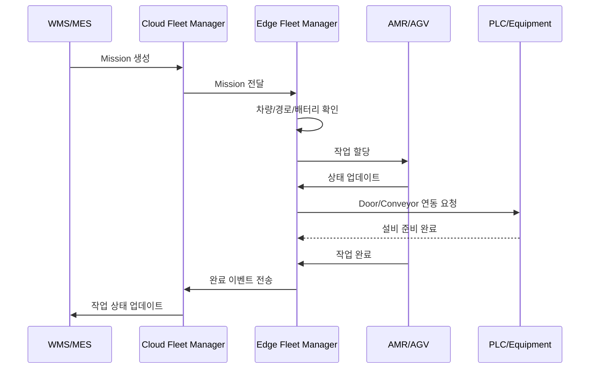

# AMR/AGV Edge-Cloud 논리 아키텍처

# 설계 고려사항

## 1. 실시간성과 안정성을 고려한 제어 위치 분리

가장 먼저 말할 수 있는 건 **실시간 제어는 Cloud가 아니라 Edge에서 처리하도록 설계했다**는 점.

AMR/AGV는 공장 내부에서 사람, 설비, 다른 차량과 같은 공간을 공유하기 때문에 지연 시간이 길어지면 바로 안전 문제가 될 수 있음. 그래서 차량 정지, 교차로 진입 제어, 충돌 방지, 속도 제한 같은 기능은 Cloud가 아니라 Edge와 Device에서 처리하도록 설계했다고 말하면 좋음.

> AMR/AGV는 현장에서 사람과 설비를 함께 사용하는 장비이기 때문에 네트워크 지연이 안전 문제로 이어질 수 있다고 판단했습니다. 따라서 실시간 제어와 안전 판단은 Cloud가 아닌 Edge에서 처리하고, Cloud는 통합 관제와 분석 중심으로 역할을 분리했습니다.

---

## 2. Cloud 장애나 인터넷 단절을 고려한 Offline-first 구조

공장이나 물류센터는 외부 인터넷 연결이 불안정하거나 Cloud 장애가 발생해도 완전히 멈추면 안 됨. 그래서 Edge가 로컬에서 작업 큐, 지도, 차량 상태, 이벤트 데이터를 가지고 계속 운영할 수 있도록 설계했다고 말할 수 있음.

> Cloud 연결이 끊기더라도 현장 작업이 즉시 중단되지 않도록 Offline-first 구조를 고려했습니다. Edge에 로컬 작업 큐, 지도 캐시, 차량 상태 저장소, 이벤트 버퍼를 두어 기존 작업은 계속 수행하고, 연결 복구 후 Cloud와 데이터를 재동기화하는 구조로 설계했습니다.

---

## 3. 안전 제어의 우선순위

AMR/AGV 시스템에서 안전은 일반적인 애플리케이션 장애보다 더 중요함. 그래서 안전 판단의 우선순위를 명확히 설계했다고 말할 수 있음.

예를 들면:

```text
1순위: AMR/AGV 자체 안전 제어
2순위: Edge Safety Rule Engine
3순위: 현장 Operator HMI
4순위: Cloud 정책
```

> 안전 제어는 Cloud 정책보다 현장 판단이 우선되도록 설계했습니다. AMR/AGV 자체 센서 기반 정지 기능을 최우선으로 두고, Edge의 Safety Rule Engine이 구역별 속도 제한, 위험 구역 진입 제한, 교차로 제어를 담당하도록 했습니다.

---

## 4. 제조사 종속성을 줄이기 위한 표준 이벤트 모델

AMR/AGV는 제조사마다 API, 프로토콜, 상태 코드가 다를 수 있음. 나중에 특정 제조사 차량만 쓰는 게 아니라 여러 장비를 붙일 가능성이 있으면, Edge Gateway에서 프로토콜을 변환하고 내부 표준 이벤트 모델로 통일하는 설계가 중요함.

> AMR/AGV 제조사별 프로토콜 차이를 고려하여 Edge Gateway에서 프로토콜 어댑터를 두고, 내부적으로는 표준 Vehicle Event Model로 변환하도록 설계했습니다. 이를 통해 Cloud 관제, 분석, 작업 할당 로직이 특정 장비 벤더에 종속되지 않도록 했습니다.

---

## 5. 현장 단위 확장성을 고려한 Site 단위 Edge 구조

공장이 하나가 아니라 여러 물류센터나 제조 라인으로 늘어날 수 있음. 그래서 Cloud는 여러 Edge Site를 관리하고, 각 Edge는 독립적인 현장 단위로 동작하게 설계했다고 말하면 좋음.

> 여러 공장이나 물류센터로 확장될 가능성을 고려하여 Site 단위 Edge 구조로 설계했습니다. 각 Edge는 독립적으로 현장 Fleet을 운영하고, Cloud는 여러 Site의 상태를 통합 관제하며 정책과 설정을 배포하는 역할을 담당하도록 했습니다.

---

## 6. 데이터 특성에 따른 저장 위치 분리

모든 데이터를 Cloud로 올리면 비용도 크고, 지연도 커지고, 네트워크 부담도 생김. 그래서 데이터의 성격에 따라 Edge와 Cloud 저장소를 분리했다고 말할 수 있음.

```text
Edge 저장:
- 실시간 차량 위치
- 현재 작업 상태
- 로컬 이벤트
- 지도 캐시
- 장애 발생 시 임시 데이터

Cloud 저장:
- 작업 이력
- 장애 통계
- 배터리 수명 데이터
- 장기 이동 경로
- 병목 분석 데이터
- 유지보수 이력
```


> 데이터의 실시간성과 보존 목적에 따라 저장 위치를 분리했습니다. 즉시 판단이 필요한 위치, 작업 상태, 장애 이벤트는 Edge에 저장하고, 장기 분석이 필요한 작업 이력, 배터리 패턴, 병목 구간 데이터는 Cloud Data Lake에 적재하도록 설계했습니다.

---

## 7. 운영자 개입을 고려한 HMI / Manual Override

실제 공장에서는 자동화만으로 끝나지 않고, 현장 작업자가 개입해야 하는 상황이 많음.

예를 들어:

* 특정 차량 수동 정지
* 작업 우선순위 변경
* 장애 차량 격리
* 특정 구역 일시 통제
* 설비 점검 중 경로 제한

그래서 Local HMI를 둔 설계는 꽤 중요함.

> 완전 자동화뿐 아니라 현장 운영자의 개입 가능성도 고려했습니다. Edge API와 연결된 Local HMI를 통해 차량 정지, 작업 재할당, 특정 구역 통제, 장애 차량 격리 같은 현장 조치를 Cloud 의존 없이 수행할 수 있도록 설계했습니다.

---

## 8. 작업 지시와 실제 차량 제어의 추상화

Cloud는 “어떤 물건을 어디로 옮겨라” 수준의 작업을 내리고, Edge가 실제 차량 선택과 경로 결정을 맡는 구조가 좋음.

> Cloud는 저수준 주행 명령이 아니라 작업 단위의 Mission을 생성하도록 설계했습니다. 예를 들어 ‘A 구역의 팔레트를 B 구역으로 이동’이라는 Mission을 Cloud가 전달하면, Edge의 Local Fleet Manager가 현장 차량 상태, 배터리, 경로 혼잡도, 교차로 점유 상태를 고려해 실제 AMR/AGV에 작업을 할당합니다.

---

## 9. 장애 격리와 복구 가능성

Edge-Cloud 구조에서는 장애가 전체 시스템으로 전파되지 않게 하는 것도 중요함.

> 장애가 발생했을 때 전체 시스템이 중단되지 않도록 장애 격리를 고려했습니다. 특정 AMR/AGV 장애는 Local Fleet Manager가 작업을 회수해 다른 차량에 재할당하고, Edge와 Cloud 간 연결 장애는 로컬 버퍼링과 재동기화로 처리하도록 설계했습니다.

---
## 논리 아키텍처 mermaid

```mermaid
flowchart TB
  subgraph Factory["Factory / Warehouse Site"]
    subgraph Device["AMR / AGV Layer"]
      AMR1["AMR / AGV"]
      Sensor["LiDAR / Camera / IMU / Encoder"]
      PLC["PLC / Conveyor / Door / Lift"]
    end

    subgraph Network["Industrial Network"]
      WIFI["Wi-Fi 6 / 5G / Private LTE"]
      MQTTLocal["Local MQTT Broker"]
    end

    subgraph Edge["Edge Platform"]
      EdgeGW["Edge Gateway"]
      FleetLocal["Local Fleet Manager"]
      Traffic["Traffic / Path Coordination"]
      Safety["Safety & Collision Rule Engine"]
      MapLocal["Local Map / Route Cache"]
      EdgeDB["Edge Time-series / Event DB"]
      EdgeAPI["Edge API"]
    end

    subgraph OnPremOps["Local Operation"]
      HMI["Operator HMI / Control Panel"]
      Monitor["Local Monitoring"]
    end
  end

  subgraph Cloud["Cloud Platform"]
    Ingest["Cloud Ingestion API"]
    FleetGlobal["Global Fleet Management"]
    Optimization["Route / Dispatch Optimization"]
    DigitalTwin["Digital Twin / Simulation"]
    DataLake["Data Lake / Warehouse"]
    Analytics["Analytics / ML"]
    Dashboard["Admin Dashboard"]
    Integration["ERP / MES / WMS Integration"]
  end

  AMR1 --> Sensor
  AMR1 <--> WIFI
  PLC <--> EdgeGW

  WIFI <--> MQTTLocal
  MQTTLocal <--> EdgeGW

  EdgeGW <--> FleetLocal
  FleetLocal <--> Traffic
  FleetLocal <--> Safety
  FleetLocal <--> MapLocal
  FleetLocal --> EdgeDB
  EdgeAPI <--> FleetLocal

  HMI <--> EdgeAPI
  Monitor <--> EdgeDB

  EdgeGW <--> Ingest
  Ingest --> DataLake
  DataLake --> Analytics
  Analytics --> Optimization
  Optimization --> FleetGlobal
  FleetGlobal <--> Integration
  FleetGlobal <--> Dashboard
  FleetGlobal --> DigitalTwin

  FleetGlobal -. "policy / mission / config sync" .-> EdgeGW
  EdgeDB -. "telemetry / event batch upload" .-> DataLake
```



---

# 1. 계층별 역할

## 1) AMR / AGV Device Layer

공장 내부에서 실제 이동과 작업을 수행하는 계층.

주요 역할:

* 위치 이동
* 장애물 감지
* 로컬 경로 추종
* 배터리 상태 보고
* 작업 상태 보고
* 비상 정지 처리
* 센서 데이터 수집

AMR/AGV는 자체적으로 어느 정도의 로컬 판단 능력을 가질 수 있음.

예를 들어:

* 전방 장애물 감지 시 즉시 정지
* 목표 지점까지 경로 추종
* 배터리 부족 시 충전 요청
* 통신 끊김 시 안전 정지 또는 지정 구역 복귀

여기서 중요한 점은 **Cloud가 직접 AMR을 실시간 조종하면 안 된다**는 것.
네트워크 지연, 장애, 외부 인터넷 단절이 발생해도 공장은 계속 안전하게 돌아가야 하기 때문.

---

## 2) Industrial Network Layer

AMR/AGV와 Edge 시스템 사이의 통신 계층.

사용 가능 기술:

* Wi-Fi 6 / Wi-Fi 6E
* Private 5G
* Private LTE
* 유선 Ethernet
* MQTT
* gRPC
* WebSocket
* OPC-UA

논리적으로는 다음 데이터를 처리함.

```text
AMR/AGV → Edge
- 현재 위치
- 속도
- 방향
- 배터리 상태
- 작업 상태
- 장애물 감지 이벤트
- 에러 코드
- 센서 요약 데이터

Edge → AMR/AGV
- 작업 할당
- 목적지
- 경로 정보
- 정지 명령
- 재시작 명령
- 속도 제한
- 구역 진입 허가
```

여기서 실시간성이 필요한 데이터는 Edge 내부에서 처리하고, Cloud에는 요약 또는 이벤트 중심으로 올리는 편이 좋음.

---

## 3) Edge Platform Layer

가장 중요한 계층.
현장 단위의 실시간 제어와 운영을 담당함.

Edge는 공장 또는 물류센터 안에 위치하는 로컬 서버, 산업용 PC, 또는 On-premise Kubernetes 클러스터로 구성할 수 있음.

주요 컴포넌트는 다음과 같음.

---

## Edge Gateway

AMR/AGV, PLC, 센서, 설비와 통신하는 진입점.

역할:

* AMR/AGV telemetry 수집
* 작업 명령 전달
* PLC / Conveyor / Door / Lift 연동
* 프로토콜 변환
* Cloud와의 동기화
* 네트워크 단절 시 로컬 버퍼링

예시:

```text
AMR Protocol / MQTT / OPC-UA / Modbus
        ↓
Edge Gateway
        ↓
내부 표준 이벤트 모델
```

즉, 제조사마다 다른 AMR/AGV 프로토콜을 내부 표준 메시지로 바꿔주는 역할.

---

## Local Fleet Manager

현장 내 AMR/AGV 전체를 관리하는 핵심 컴포넌트.

역할:

* 작업 할당
* 차량 상태 관리
* 충전 스케줄 관리
* 차량별 mission 관리
* 작업 우선순위 처리
* 장비 장애 시 대체 차량 배정
* Cloud 명령을 현장 상황에 맞게 실행

예를 들어 Cloud에서 다음 작업이 내려온다고 가정하면:

```text
A구역의 팔레트를 B구역으로 이동
```

Local Fleet Manager는 이를 실제 차량 명령으로 변환함.

```text
1. 사용 가능한 AMR 탐색
2. 현재 위치와 배터리 확인
3. 경로 점유 상태 확인
4. 가장 적합한 차량 선택
5. 목적지 및 경유지 전달
6. 작업 상태 추적
```

---

## Traffic / Path Coordination

여러 AMR/AGV가 같은 공간을 공유할 때 충돌과 병목을 방지하는 컴포넌트.

역할:

* 교차로 진입 제어
* 구역 단위 lock 관리
* 단방향 / 양방향 통로 제어
* 병목 구간 속도 제한
* deadlock 감지
* 우회 경로 계산

예시:

```text
AMR-1: A 통로 진입 요청
AMR-2: 반대 방향에서 A 통로 진입 요청

Traffic Coordinator:
- AMR-1 우선 진입 허가
- AMR-2 대기 명령
- AMR-1 통과 후 AMR-2 진입 허가
```

이 기능은 반드시 Edge에 가까워야 함.
Cloud에서 처리하면 지연 시간 때문에 현장 안전성이 떨어짐.

---

## Safety & Collision Rule Engine

안전 정책을 처리하는 컴포넌트.

역할:

* 위험 구역 진입 제한
* 사람 감지 시 정지
* 속도 제한 구역 적용
* 충돌 가능성 판단
* 비상 정지 전파
* 설비 상태 기반 이동 제한

예시:

```text
작업자가 특정 구역에 진입
→ 해당 구역 AMR 속도 제한
→ 위험도 증가 시 정지 명령
```

안전 관련 판단은 **Cloud 의존 없이 Edge와 Device에서 처리**해야 함.

---

## Local Map / Route Cache

현장의 지도, 경로, 구역 정보를 저장하는 컴포넌트.

저장 데이터:

* 공장 지도
* 랙 위치
* 출입문 위치
* 충전소 위치
* 금지 구역
* 속도 제한 구역
* 교차로 정보
* 작업 구역 정보

Cloud에서 전체 지도 버전을 관리하고, Edge는 해당 현장의 지도만 캐시해서 사용.

---

## Edge DB / Event Store

현장 운영 데이터 저장소.

저장 데이터:

* 차량 위치 이력
* 작업 상태
* 장애 이벤트
* 배터리 이력
* 교통 병목 이벤트
* 설비 연동 이벤트
* Cloud 전송 대기 데이터

Cloud 연결이 끊겨도 데이터를 잃지 않기 위해 Edge에 임시 저장소가 필요함.

---

## 4) Cloud Platform Layer

Cloud는 실시간 제어보다는 **통합 운영, 분석, 최적화, 전사 시스템 연동**을 담당함.

---

## Cloud Ingestion API

여러 현장의 Edge에서 올라오는 데이터를 받는 진입점.

수집 데이터:

* AMR/AGV 상태
* 작업 완료 이력
* 장애 이벤트
* 배터리 통계
* 이동 경로 이력
* 병목 구간 정보
* 설비 연동 이벤트

---

## Global Fleet Management

여러 공장 또는 물류센터의 Fleet 상태를 통합 관리.

역할:

* 사이트별 AMR/AGV 현황 조회
* 전체 작업량 확인
* 차량 가동률 분석
* 유지보수 상태 관리
* 사이트별 정책 배포
* Edge별 설정 관리

예를 들어:

```text
평택 공장 AMR 30대
구미 공장 AGV 20대
부산 물류센터 AMR 50대
```

이런 식으로 여러 현장을 Cloud에서 통합 관리.

---

## Route / Dispatch Optimization

Cloud에서 장기적이고 계산량이 큰 최적화를 수행.

역할:

* 작업 배정 알고리즘 개선
* 피크 시간대 병목 분석
* 최적 충전 스케줄 계산
* 구역별 AMR 배치 전략
* 시뮬레이션 기반 경로 개선

단, Cloud에서 계산한 결과는 바로 차량을 움직이는 명령이 아니라 **정책 또는 추천안**으로 Edge에 내려가는 게 좋음.

예시:

```text
Cloud:
- 최근 7일간 A-B 구간 병목 심함
- 오전 9~11시에는 C 우회 경로 권장
- 충전소 2번 혼잡도가 높음

Edge:
- 현장 상황 확인 후 정책 반영
```

---

## Digital Twin / Simulation

공장이나 물류센터를 가상화해서 시뮬레이션하는 컴포넌트.

활용 예시:

* 신규 AMR 투입 전 시뮬레이션
* 경로 변경 영향 분석
* 물류량 증가 시 병목 예측
* 작업 스케줄 변경 테스트
* 공장 레이아웃 변경 검증

---

## Data Lake / Analytics / ML

장기 데이터를 저장하고 분석하는 계층.

분석 대상:

* 차량 가동률
* 평균 작업 완료 시간
* 병목 구간
* 정지 이벤트
* 충전 패턴
* 장애 빈도
* 부품 교체 주기
* 작업 지연 원인

ML을 적용한다면:

* 배터리 수명 예측
* 장애 예측
* 수요 예측
* 혼잡도 예측
* 작업 배정 최적화

---

## ERP / MES / WMS Integration

실제 물류·제조 시스템과 연결되는 계층.

연동 대상:

* WMS: 입고, 출고, 피킹, 재고 이동
* MES: 생산 공정, 작업 지시, 설비 상태
* ERP: 주문, 자재, 생산 계획
* TMS: 운송 계획
* PLC/SCADA: 현장 설비 제어

대표 흐름:

```text
WMS/MES에서 작업 지시 생성
        ↓
Cloud Integration Layer
        ↓
Global Fleet Management
        ↓
Site Edge Fleet Manager
        ↓
AMR/AGV 작업 수행
        ↓
작업 완료 이벤트 Cloud로 전송
        ↓
WMS/MES 상태 업데이트
```

---

# 2. 전체 데이터 흐름

## 작업 지시 흐름



예시:

```text
"라인 3에서 완성품 팔레트를 출하장으로 이동"
```

Cloud는 작업을 생성하고, Edge는 현장 상황에 맞게 실제 차량에 할당함.

---

## 실시간 상태 흐름

```text
AMR / AGV
  ↓
Edge Gateway
  ↓
Local Fleet Manager
  ↓
HMI / Local Monitoring
```

이 흐름은 Cloud를 거치지 않는 게 좋음.

이유:

* 지연 시간 최소화
* 인터넷 장애 대응
* 현장 안전성 확보
* 작업 중단 방지

---

## 분석 데이터 흐름

```text
AMR / AGV
  ↓
Edge DB
  ↓
Cloud Ingestion
  ↓
Data Lake
  ↓
Analytics / ML
  ↓
Optimization
```

실시간 제어 데이터가 아니라 이력, 통계, 이벤트 중심 데이터가 Cloud로 올라감.

---

# 3. 주요 Use Case 및 업무 흐름

본 아키텍처의 대표 Use Case는 WMS 또는 MES에서 생성된 물류 이송 작업을 AMR/AGV가 수행하고, 그 결과를 다시 상위 시스템과 Cloud에 반영하는 흐름이다. 이를 통해 Cloud, Edge, AMR/AGV, 외부 설비가 각각 어떤 책임을 가지는지 명확히 정의할 수 있다.

대표적인 업무 흐름은 다음과 같다.

```text
1. WMS/MES에서 이송 작업 생성
2. Cloud Fleet Manager가 작업을 Mission 단위로 변환
3. Cloud가 해당 Site의 Edge로 Mission 전달
4. Edge Fleet Manager가 사용 가능한 AMR/AGV 조회
5. 차량 위치, 배터리, 적재 가능 여부, 경로 혼잡도를 기준으로 차량 선택
6. Traffic Coordinator가 경로와 구역 점유 상태 확인
7. Edge가 AMR/AGV에 작업 할당
8. AMR/AGV가 적재 지점으로 이동
9. Edge가 PLC, Door, Conveyor, Lift 등 외부 설비와 연동
10. AMR/AGV가 목적지로 이동
11. 작업 완료 후 Edge가 Mission 상태 업데이트
12. Cloud와 WMS/MES에 작업 완료 이벤트 반영
```

이 흐름에서 Cloud는 전체 작업 지시와 운영 정책을 관리하고, Edge는 현장 상황을 반영하여 실제 차량 선택, 경로 조정, 교차로 제어, 설비 연동을 수행한다. AMR/AGV는 Edge로부터 전달받은 Mission을 기반으로 실제 이동을 수행하며, 장애물 감지나 비상 정지와 같은 즉각적인 안전 제어는 차량 자체 또는 Edge에서 처리한다.

즉, Cloud는 “무엇을 수행할 것인가”를 관리하고, Edge는 “현장에서 어떤 차량이 어떻게 수행할 것인가”를 결정한다. 이를 통해 Cloud 중심의 통합 관리와 Edge 중심의 실시간 현장 제어를 동시에 만족할 수 있다.

---

# 4. Edge와 Cloud의 책임 분리

| 구분         | Edge          | Cloud         |
| ---------- | ------------- | ------------- |
| 실시간 차량 제어  | 담당            | 비권장           |
| 충돌 방지      | 담당            | 비권장           |
| 교차로 제어     | 담당            | 비권장           |
| 장애물 대응     | Device / Edge | 비권장           |
| 작업 할당      | 현장 단위 담당      | 전체 정책 담당      |
| 경로 최적화     | 단기 / 실시간      | 장기 / 분석 기반    |
| 지도 사용      | 로컬 캐시         | 원본 관리         |
| 데이터 저장     | 단기 저장         | 장기 저장         |
| 장애 대응      | 현장 즉시 대응      | 분석 / 리포트      |
| MES/WMS 연동 | 일부 가능         | 주 담당          |
| 대시보드       | 현장 운영 화면      | 통합 관제 화면      |
| ML/분석      | 경량 추론 가능      | 학습 / 분석 / 최적화 |

---

# 5. 장애 상황 기준 설계

이 아키텍처에서 중요한 건 **Cloud가 죽어도 현장은 멈추지 않아야 한다**는 것.

## Cloud 연결 장애

Cloud 연결 끊김
→ Edge가 기존 작업 계속 수행
→ 신규 Cloud 작업은 대기
→ Edge DB에 이벤트 저장
→ 연결 복구 후 batch upload


## Edge 장애

Edge 장애
→ AMR/AGV는 안전 모드 진입
→ 정지 또는 지정 위치 복귀
→ Local HMI에서 복구
→ Cloud에 장애 이벤트 보고


## 네트워크 품질 저하

패킷 손실 / 지연 증가
→ Edge가 차량별 heartbeat 감시
→ 일정 시간 이상 미응답 시 안전 정지
→ 통신 복구 후 상태 재동기화


## 특정 차량 장애

AMR 장애 발생
→ Local Fleet Manager가 작업 회수
→ 대체 차량 재할당
→ 장애 차량은 정비 상태로 전환
→ Cloud에 장애 이력 전송

---

# 6. 메시지 모델 예시

## AMR 상태 이벤트

```json
{
  "eventType": "AMR_STATUS",
  "siteId": "factory-a",
  "vehicleId": "amr-001",
  "timestamp": "2026-05-30T10:15:30+09:00",
  "position": {
    "x": 12.4,
    "y": 7.8,
    "theta": 90
  },
  "speed": 1.2,
  "battery": 76,
  "status": "MOVING",
  "currentMissionId": "mission-20260530-001"
}
```

## 작업 지시 이벤트

```json
{
  "eventType": "MISSION_REQUEST",
  "missionId": "mission-20260530-001",
  "siteId": "factory-a",
  "priority": "HIGH",
  "source": "line-3",
  "destination": "shipping-area-1",
  "payloadType": "pallet",
  "deadline": "2026-05-30T11:00:00+09:00"
}
```

## 장애 이벤트

```json
{
  "eventType": "VEHICLE_FAULT",
  "siteId": "factory-a",
  "vehicleId": "agv-003",
  "faultCode": "LIDAR_BLOCKED",
  "severity": "WARNING",
  "timestamp": "2026-05-30T10:20:00+09:00",
  "currentMissionId": "mission-20260530-002"
}
```

---

# 7. 설계 포인트

## 1) Cloud는 명령자가 아니라 관리자에 가깝게

Cloud가 직접 `move forward`, `turn left`, `stop` 같은 저수준 명령을 내리면 위험함.

좋은 구조:

```text
Cloud: 어떤 작업을 수행할지 결정
Edge: 어떤 차량이 어떻게 수행할지 결정
AMR/AGV: 실제 이동과 즉시 안전 제어 수행
```

---

## 2) Edge는 Offline-first로 설계

Cloud 연결이 끊겨도 Edge는 계속 동작해야 함.

필요한 기능:

* 로컬 작업 큐
* 로컬 지도 캐시
* 로컬 Fleet 상태 저장
* 이벤트 버퍼링
* 재연결 후 동기화
* 중복 이벤트 제거

---

## 3) Safety는 Device + Edge 중심

안전은 Cloud에 맡기면 안 됨.

우선순위:

```text
1순위: AMR/AGV 자체 안전 제어
2순위: Edge Safety Rule Engine
3순위: Operator HMI
4순위: Cloud 정책
```

---

## 4) 표준 이벤트 모델 필요

AMR/AGV 제조사가 여러 곳이면 프로토콜이 달라질 수 있음.

그래서 내부에서는 다음처럼 표준화하는 게 좋음.

```text
Vendor A AMR Protocol
Vendor B AGV Protocol
Vendor C Robot API
        ↓
Edge Gateway Adapter
        ↓
Internal Vehicle Event Model
```

이렇게 해야 Cloud, Dashboard, Analytics는 특정 제조사에 종속되지 않음.

---

# 8. 상태 모델 설계

AMR/AGV 기반 물류·제조 시스템에서는 단순히 차량에 작업을 할당하고 완료 여부만 확인하는 것으로는 충분하지 않다. 실제 현장에서는 작업 대기, 경로 점유 대기, 설비 연동 대기, 배터리 부족, 차량 장애, 작업 재할당, 비상 정지 등 다양한 상태 변화가 발생한다. 따라서 본 아키텍처에서는 작업 단위의 상태를 나타내는 **Mission 상태 모델**과 차량 자체의 상태를 나타내는 **Vehicle 상태 모델**을 분리하여 설계했다.

Mission 상태와 Vehicle 상태를 분리한 이유는 하나의 차량 상태가 곧 작업 상태를 의미하지 않기 때문이다. 예를 들어 차량이 `CHARGING` 상태라고 해서 특정 Mission이 실패한 것은 아니며, Mission이 `WAITING_FOR_TRAFFIC_CLEARANCE` 상태라고 해서 차량 자체에 장애가 발생한 것도 아니다. 이처럼 작업의 진행 상태와 차량의 물리적·운영상태를 분리하여 관리해야 관제, 재할당, 장애 대응, 운영 분석을 일관되게 처리할 수 있다.

---

## 8.1 Mission 상태 모델

Mission은 WMS, MES 또는 Cloud Fleet Manager에서 생성된 작업 지시 단위를 의미한다. 예를 들어 “A 구역의 팔레트를 B 구역으로 이동”하는 요청은 하나의 Mission으로 표현될 수 있다. Mission 상태 모델은 해당 작업이 생성된 이후 어떤 단계로 진행되고 있는지를 나타낸다.

기본적인 Mission 상태 흐름은 다음과 같다.

```text
CREATED
  ↓
ASSIGNED
  ↓
MOVING_TO_PICKUP
  ↓
PICKING
  ↓
MOVING_TO_DROPOFF
  ↓
DROPPING
  ↓
COMPLETED
```

각 상태의 의미는 다음과 같다.

| 상태                | 설명                                              |
| ----------------- | ----------------------------------------------- |
| CREATED           | WMS/MES 또는 Cloud에서 Mission이 생성된 상태              |
| ASSIGNED          | Edge Fleet Manager가 특정 AMR/AGV에 Mission을 할당한 상태 |
| MOVING_TO_PICKUP  | 차량이 적재 지점으로 이동 중인 상태                            |
| PICKING           | 적재 지점에서 화물을 싣거나 설비와 연동 중인 상태                    |
| MOVING_TO_DROPOFF | 차량이 하역 지점으로 이동 중인 상태                            |
| DROPPING          | 하역 지점에서 화물을 내리거나 설비와 연동 중인 상태                   |
| COMPLETED         | Mission이 정상적으로 완료된 상태                           |

하지만 실제 현장에서는 정상 흐름만 존재하지 않는다. 경로가 막히거나, 교차로 진입 허가를 기다리거나, 자동문·컨베이어·리프트 같은 설비 응답을 기다려야 하는 상황이 발생할 수 있다. 또한 차량 배터리가 부족하거나 장애가 발생하면 Mission을 일시 중지하거나 다른 차량에 재할당해야 한다.

이를 위해 다음과 같은 예외 상태를 함께 정의한다.

| 상태                            | 설명                                         |
| ----------------------------- | ------------------------------------------ |
| PAUSED                        | 운영자 또는 시스템 정책에 의해 Mission이 일시 중지된 상태       |
| FAILED                        | 차량 장애, 설비 장애, 경로 문제 등으로 Mission 수행에 실패한 상태 |
| CANCELLED                     | 작업 지시가 취소된 상태                              |
| REASSIGNED                    | 기존 차량에서 다른 차량으로 Mission이 재할당된 상태           |
| WAITING_FOR_TRAFFIC_CLEARANCE | 교차로, 좁은 통로, 혼잡 구간 등의 진입 허가를 대기 중인 상태       |
| WAITING_FOR_DOOR_OPEN         | 자동문, 셔터, 리프트, 컨베이어 등 외부 설비 응답을 기다리는 상태     |
| LOW_BATTERY                   | 작업 수행 중 차량 배터리 부족으로 충전 또는 재할당 판단이 필요한 상태   |

Mission 상태 모델을 정의함으로써 작업의 현재 위치를 명확히 추적할 수 있으며, 장애 발생 시에도 어떤 단계에서 문제가 발생했는지 빠르게 파악할 수 있다. 또한 `FAILED`, `PAUSED`, `REASSIGNED`와 같은 상태를 명시적으로 관리하면 작업 재시도, 대체 차량 배정, 운영자 개입 같은 후속 처리를 일관되게 수행할 수 있다.

---

## 8.2 Vehicle 상태 모델

Vehicle 상태 모델은 AMR/AGV 차량 자체의 운영 상태를 나타낸다. Mission 상태가 작업의 진행 단계를 나타낸다면, Vehicle 상태는 차량이 현재 어떤 물리적·운영상태에 있는지를 표현한다.

차량 상태는 다음과 같이 정의할 수 있다.

```text
IDLE
ASSIGNED
MOVING
WAITING
CHARGING
ERROR
MAINTENANCE
OFFLINE
EMERGENCY_STOP
```

각 상태의 의미는 다음과 같다.

| 상태             | 설명                                    |
| -------------- | ------------------------------------- |
| IDLE           | 수행 중인 작업이 없고 새로운 Mission을 받을 수 있는 상태  |
| ASSIGNED       | Mission이 할당되었지만 아직 실제 이동을 시작하지 않은 상태  |
| MOVING         | 목적지 또는 경유지로 이동 중인 상태                  |
| WAITING        | 교차로, 설비 응답, 작업자 개입 등으로 대기 중인 상태       |
| CHARGING       | 충전소에서 배터리를 충전 중인 상태                   |
| ERROR          | 센서, 주행 모듈, 통신, 적재 장치 등에서 오류가 발생한 상태   |
| MAINTENANCE    | 정비 또는 점검 대상으로 분류되어 작업 할당에서 제외된 상태     |
| OFFLINE        | 차량과 Edge 간 통신이 끊긴 상태                  |
| EMERGENCY_STOP | 비상 정지 버튼, 안전 센서, 운영자 개입 등으로 즉시 정지한 상태 |

Vehicle 상태 모델은 Fleet Manager가 차량을 선택하고 작업을 할당하는 기준으로 사용된다. 예를 들어 `IDLE` 상태인 차량 중 현재 위치, 배터리 잔량, 목적지까지의 거리, 경로 혼잡도를 고려하여 가장 적합한 차량을 선택할 수 있다. 반대로 `CHARGING`, `ERROR`, `MAINTENANCE`, `OFFLINE`, `EMERGENCY_STOP` 상태의 차량은 일반적인 작업 할당 대상에서 제외된다.

또한 Vehicle 상태는 현장 운영자에게도 중요한 정보가 된다. 운영자는 HMI나 Dashboard를 통해 어떤 차량이 이동 중인지, 어떤 차량이 충전 중인지, 어떤 차량이 장애 상태인지 확인할 수 있다. 이를 통해 장애 차량 격리, 수동 정지, 정비 요청, 작업 재할당 등의 조치를 빠르게 수행할 수 있다.

---

## 8.3 Mission 상태와 Vehicle 상태의 분리 필요성

Mission 상태와 Vehicle 상태는 서로 연관되어 있지만 동일한 의미를 가지지는 않는다. 따라서 두 상태 모델을 분리하여 관리해야 한다.

예를 들어 하나의 Mission이 `WAITING_FOR_TRAFFIC_CLEARANCE` 상태일 때, 차량은 `WAITING` 상태일 수 있다. 이 경우 문제는 차량 장애가 아니라 교차로 또는 통로 점유로 인한 대기 상황이다. 반대로 차량이 `ERROR` 상태가 되면 해당 차량이 수행 중이던 Mission은 `PAUSED`, `FAILED`, 또는 `REASSIGNED` 상태로 전환될 수 있다.

다음은 Mission 상태와 Vehicle 상태가 함께 해석되는 예시이다.

| 상황        | Mission 상태                    | Vehicle 상태        | 처리 방향                           |
| --------- | ----------------------------- | ----------------- | ------------------------------- |
| 정상 이동 중   | MOVING_TO_DROPOFF             | MOVING            | 작업 계속 수행                        |
| 교차로 진입 대기 | WAITING_FOR_TRAFFIC_CLEARANCE | WAITING           | Traffic Coordinator가 진입 순서 결정   |
| 설비 응답 대기  | WAITING_FOR_DOOR_OPEN         | WAITING           | PLC/설비 응답 확인 후 재개               |
| 배터리 부족    | LOW_BATTERY                   | MOVING 또는 WAITING | 작업 지속 여부 판단 또는 대체 차량 재할당        |
| 차량 장애     | PAUSED 또는 FAILED              | ERROR             | Mission 회수 후 재할당 검토             |
| 비상 정지     | PAUSED                        | EMERGENCY_STOP    | 현장 운영자 확인 후 재개 또는 취소            |
| 통신 단절     | PAUSED                        | OFFLINE           | Heartbeat timeout 처리 및 안전 모드 진입 |
| 충전 중      | 대기 중인 Mission 없음              | CHARGING          | 작업 할당 대상에서 제외                   |

이처럼 두 상태 모델을 분리하면 시스템이 현재 상황을 더 정확하게 판단할 수 있다. 특히 장애 대응 시 Mission의 문제인지, 차량의 문제인지, 경로의 문제인지, 설비 연동 문제인지를 구분할 수 있어 운영 복잡도를 줄일 수 있다.

---

## 8.4 상태 모델 기반 운영 효과

상태 모델을 명확히 정의하면 단순한 관제 화면 이상의 효과를 얻을 수 있다.

첫째, 작업 추적이 쉬워진다. 각 Mission이 어느 단계에 있는지 확인할 수 있으므로 작업 지연이 적재 단계에서 발생했는지, 이동 중 발생했는지, 설비 연동 단계에서 발생했는지 파악할 수 있다.

둘째, 장애 대응이 일관된다. 차량 장애, 통신 단절, 비상 정지, 배터리 부족과 같은 상황을 상태 전이로 표현하면, 시스템은 미리 정의된 정책에 따라 작업 일시 중지, 재시도, 재할당, 운영자 알림을 수행할 수 있다.

셋째, 운영 분석이 가능해진다. Mission 상태 이력과 Vehicle 상태 이력을 Cloud에 적재하면 평균 작업 시간, 대기 시간, 교차로 병목, 차량별 장애 빈도, 충전 패턴 등을 분석할 수 있다. 이는 이후 경로 최적화, 차량 배치 전략, 충전 스케줄 개선에 활용될 수 있다.

넷째, Edge와 Cloud 간 책임 분리가 명확해진다. Edge는 Mission과 Vehicle의 실시간 상태를 기반으로 현장 제어와 장애 대응을 수행하고, Cloud는 상태 이력을 분석하여 장기적인 운영 개선과 정책 최적화를 담당한다.

따라서 본 아키텍처에서는 Mission 상태 모델과 Vehicle 상태 모델을 분리하여 정의하고, 이를 Local Fleet Manager, Traffic Coordinator, Safety Rule Engine, Cloud Analytics가 공통으로 참조할 수 있는 운영 기준으로 사용하도록 설계했다.
