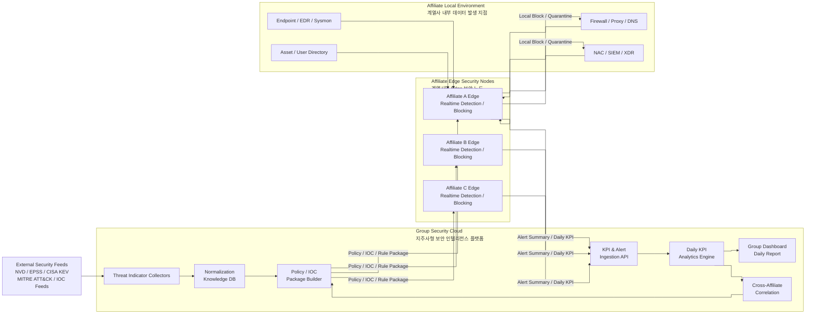
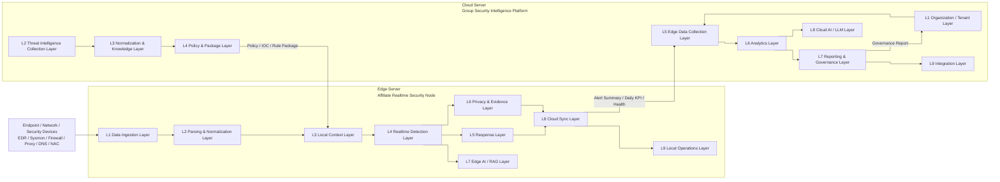
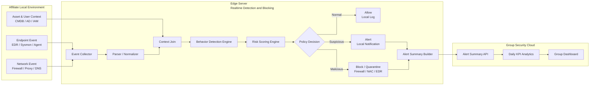
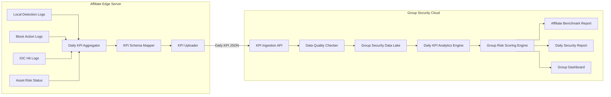
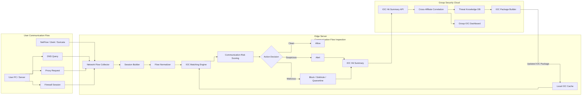
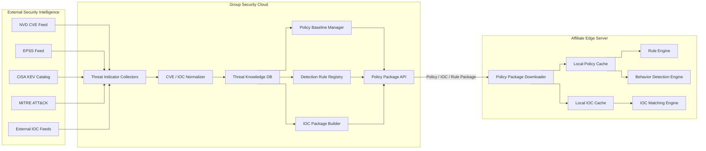
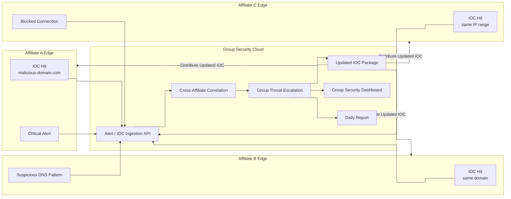

# 0. 개요

직전 주의 피드백 등을 반영하여, 핵심 방향성 변경과 함께 Layered Architecture 및 Module 설계과정을 진행하고, 이를 바탕으로 Dataflow를 명확화하는 과정을 거쳤습니다.

# 1. 핵심 방향성 변경

## 1.1 기존 방향성

기존 Cloud는 고객사 또는 하위 조직의 보안 이벤트를 중앙에서 받아 종합적으로 관제하는 **Central SOC**에 가까웠습니다:

```
계열사 / 고객사 Edge
→ 중앙 Cloud SOC
→ 통합 관제
→ 대응 판단
```

이 구조에서는 Cloud가 고객사 통합 관제센터의 개념이었다보니, 다음과 같은 문제가 있었습니다:

| 문제 | 설명 |
| --- | --- |
| Cloud 역할이 모호함 | Edge가 탐지·분석·대응을 대부분 수행하는 것처럼 보여 Cloud의 존재 이유가 약함 |
| Edge 역할이 과도함 | Edge가 실시간 처리뿐 아니라 지표 분석, 정책 판단, LLM 분석까지 모두 담당하는 구조처럼 보임 |
| 아키텍처 흐름이 불명확함 | 실시간 탐지 흐름, 일일 지표 흐름, 정책 배포 흐름이 하나의 그림 안에 섞임 |
| 구현 목표가 넓음 | 보안 관제, LLM, CVE Collector, SOAR, Edge Agent가 모두 포함되어 범위가 흐려짐 |

---

## 1.2 변경 방향성

이런 문제를 해결하기 위해, Cloud는 고객사별 관제센터가 아니라 **대기업 지주사 관점에서 전체 계열사의 보안 상태를 종합적으로 바라보는 Group Security Cloud**로 정의를 변경했습니다.

```
Cloud = 지주사형 보안 인텔리전스 플랫폼
Edge = 계열사별 실시간 탐지·차단 노드
Endpoint / Network = 원천 보안 데이터 발생 지점
```

즉, Cloud는 개별 이벤트를 실시간으로 직접 처리하기보다, 전체 계열사의 보안 상태를 표준 지표로 수집하고 비교·분석합니다.

반대로 Edge는 각 계열사 내부에 위치하여 원천 로그, 네트워크 흐름, 사용자 행위 데이터를 기반으로 실시간 탐지와 차단을 수행합니다.

---

## 1.3 변경 후 역할 정의

| 구분 | Edge Server | Cloud Server |
| --- | --- | --- |
| 위치 | 각 계열사 내부 | 지주사 또는 그룹 보안 조직 |
| 핵심 역할 | 실시간 탐지, 통신흐름 분석, 로컬 차단 | 보안지표 수집, 일일 KPI 분석, 계열사별 위험도 비교 |
| 처리 데이터 | 원천 로그, 네트워크 흐름, 사용자 행위, 자산 정보 | 요약 Alert, 일일 KPI, IOC 적중 통계, CVE/KEV/EPSS 지표 |
| 처리 주기 | 실시간 / 준실시간 | 일 단위 / 주 단위 / 월 단위 분석 |
| 보관 데이터 | 민감 원천 데이터, 증거 로그 | 표준화된 요약 데이터, 통계, 정책, 리포트 |
| 주요 출력 | 탐지 결과, 차단 결과, Alert Summary | 그룹 보안 대시보드, 일일 리포트, 정책 패키지 |
| 장애 시 동작 | Cloud와 단절되어도 로컬 탐지·차단 지속 | Edge 상태 수집 및 정책 동기화 재시도 |

---

## 1.4 전반적인 서비스 아키텍처



변경 후 프로젝트의 핵심 메시지는 다음과 같습니다:

> **각 계열사 Edge는 실시간 보안 대응을 수행하고, 지주사 Cloud는 전 계열사의 보안 데이터를 지표화하여 그룹 차원의 보안 상태를 분석한다.**
> 

이를 통해 Edge와 Cloud의 역할을 다음처럼 명확히 분리할 수 있었습니다:

| 구분 | 담당 영역 |
| --- | --- |
| Edge | 실시간 행위탐지, 악성 통신 식별, 로컬 차단, 원천 로그 보관 |
| Cloud | 보안지표 수집, 계열사별 KPI 분석, IOC·정책 배포, 그룹 리포트 생성 |

---

# 2. 구현 핵심기능

## 2.1 구현 목표 요약

이후 본 프로젝트의 구현 목표를 확정했습니다:

- 계열사별 Edge: 실시간 행위탐지, 통신흐름 내 악성지표 식별, 로컬 차단을 수행
- 지주사 Cloud: 전 계열사의 보안관제지표와 위협지표를 수집·분석
    
    ⇒ 그룹 차원의 보안 위험도와 정책 개선 방향을 제공하는 Edge-Cloud 보안 데이터 플랫폼
    

---

## 2.2 핵심 기능 1: 실시간 행위탐지 및 차단

실시간 행위탐지 및 차단은 Edge가 담당합니다.

사용자 PC, 서버, 네트워크 장비, EDR, 방화벽, NAC 등에서 발생하는 이벤트를 계열사 Edge가 수집하고, 로컬 정책과 IOC를 기준으로 위험도를 판단합니다.

### 주요 처리 대상

| 대상 | 예시 |
| --- | --- |
| 사용자 행위 | 비정상 로그인, 비인가 소프트웨어 실행, 권한 상승 시도 |
| 프로세스 행위 | 의심 프로세스 실행, 스크립트 실행, 악성 명령어 패턴 |
| 네트워크 행위 | 비정상 외부 접속, 금지 포트 통신, 알려진 악성 IP 접속 |
| 보안장비 이벤트 | EDR 탐지, 방화벽 차단, NAC 격리, Proxy 경고 |
| 자산 상태 | 취약 버전 사용, 외부 노출 서비스, 중요 자산 접근 |

### Edge 처리 결과

| 결과 | 설명 |
| --- | --- |
| Allow | 정상 이벤트로 판단하고 로컬 로그만 저장 |
| Alert | 위험 가능성이 있어 로컬 Alert 생성 |
| Block | 방화벽, Proxy, NAC, EDR과 연계하여 차단 |
| Quarantine | 감염 의심 단말 또는 서버를 격리 |
| Summary Upload | Cloud로 Alert Summary와 차단 통계 업로드 |

### 구축 목표 기준

| 항목 | 기준 |
| --- | --- |
| 처리 위치 | 계열사 Edge 내부 |
| 처리 속도 | 실시간 또는 준실시간 |
| Cloud 의존성 | Cloud 장애 시에도 기본 탐지·차단 가능 |
| Cloud 전송 데이터 | 원천 로그가 아닌 요약 Alert, 차단 결과, KPI |
| PoC 목표 | Mock 이벤트 기반 탐지·차단 시뮬레이션 구현 |

---

## 2.3 핵심 기능 2: 일일 보안관제지표 분석 및 수집

일일 보안관제지표 분석은 Cloud가 담당합니다.

Edge는 하루 동안 발생한 보안 이벤트, 차단 이력, IOC 적중 결과, 취약점 노출 상태를 집계하고, Cloud는 이를 계열사별로 비교·분석합니다.

### 수집할 주요 KPI

| KPI | 설명 |
| --- | --- |
| Total Alert Count | 일일 전체 Alert 수 |
| Critical Alert Count | 고위험 Alert 수 |
| Block Count | 차단 또는 격리 수행 건수 |
| IOC Hit Count | 악성 IP, Domain, URL, Hash 적중 수 |
| Top Risk User | 위험 이벤트가 많이 발생한 사용자 |
| Top Risk Asset | 위험 이벤트가 많이 발생한 자산 |
| External Communication Risk | 외부 통신 이상징후 |
| KEV Exposure Count | CISA KEV 취약점과 연결된 자산 수 |
| EPSS High Risk CVE Count | 악용 가능성이 높은 CVE 노출 수 |
| Policy Violation Count | 비인가 SW 실행, 금지 포트 사용 등 정책 위반 수 |
| Edge Health Status | Edge 수집기, 룰 버전, 정책 동기화 상태 |

### Cloud 분석 결과

| 결과 | 설명 |
| --- | --- |
| 계열사별 위험도 | 각 계열사의 일일 보안 위험 점수 |
| Top Risk 계열사 | 위험 이벤트가 급증한 계열사 식별 |
| Top Risk 자산군 | 그룹 전체에서 위험도가 높은 자산군 식별 |
| IOC 확산 현황 | 동일 악성지표가 여러 계열사에서 관측되는지 분석 |
| CVE 노출 현황 | KEV, EPSS 기반 고위험 취약점 노출도 분석 |
| 일일 보안 리포트 | 지주사 보안 조직용 일일 리포트 자동 생성 |

### 구축 목표 기준

| 항목 | 기준 |
| --- | --- |
| 처리 위치 | Cloud 중심 |
| 수집 주기 | 1일 1회 기본 |
| 고위험 이벤트 | 준실시간 업로드 가능 |
| 데이터 단위 | Raw log가 아닌 KPI, Summary, 통계 |
| PoC 목표 | 계열사별 Daily KPI 업로드 및 Cloud Dashboard 표시 |

---

## 2.4 핵심 기능 3: 사용자의 통신흐름 내 악성지표 식별

사용자의 통신흐름 내 악성지표 식별은 Edge와 Cloud가 함께 담당합니다.

Edge는 실제 통신 경로에 위치하여 DNS, Proxy, Firewall, Zeek, Suricata, NetFlow 등의 데이터를 기반으로 악성 IP, Domain, URL, Hash, TLS Fingerprint를 식별합니다.

Cloud는 외부 위협 인텔리전스와 각 계열사 Edge에서 올라온 IOC 적중 결과를 종합하여 그룹 차원의 악성지표 확산 여부를 분석합니다.

### 식별 대상

| 악성지표 유형 | 예시 |
| --- | --- |
| IP | 악성 C2 서버, 스캐닝 IP, 봇넷 IP |
| Domain | 피싱 도메인, DGA 도메인, 악성 다운로드 도메인 |
| URL | 악성 파일 다운로드 URL, 피싱 URL |
| File Hash | 악성 실행파일, 스크립트, 드로퍼 Hash |
| TLS Fingerprint | JA3 / JA4 Fingerprint |
| Certificate | 악성 인증서, 비정상 인증서 |
| ASN / GeoIP | 위험 국가, 의심 ASN, 비정상 해외 통신 |

### 역할 분리

| 단계 | Edge | Cloud |
| --- | --- | --- |
| IOC 수집 | 로컬 캐시 사용 | 외부 IOC 수집 및 정규화 |
| 통신흐름 분석 | DNS, Proxy, Firewall, NetFlow 분석 | 계열사 간 동일 IOC 상관분석 |
| 악성지표 매칭 | 실시간 IOC Matching | IOC 신뢰도 및 확산도 분석 |
| 차단 | Edge에서 즉시 실행 | 차단 정책 및 IOC Package 배포 |
| 리포트 | IOC Hit Summary 업로드 | 그룹 IOC 확산 리포트 생성 |

### 구축 목표 기준

| 항목 | 기준 |
| --- | --- |
| 실시간 식별 | Edge에서 수행 |
| IOC 최신화 | Cloud에서 수집 후 Edge로 배포 |
| 차단 실행 | Edge Firewall, Proxy, NAC 연계 |
| 확산 분석 | Cloud에서 계열사 간 상관분석 |
| PoC 목표 | Mock 통신흐름에서 IOC 매칭 후 차단 시뮬레이션 |

---

## 2.5 MVP 구현 범위

초기 구현 범위는 다음과 같이 설정했습니다.

| 단계 | 구현 항목 | 위치 | 산출물 |
| --- | --- | --- | --- |
| 1 | NVD / EPSS / CISA KEV Collector | Cloud | 보안지표 수집기 |
| 2 | 계열사 / Edge Registry | Cloud | 계열사 및 Edge 등록 관리 |
| 3 | IOC / Policy Package Builder | Cloud | Edge 배포용 정책 패키지 |
| 4 | Mock Endpoint / Network Event Generator | Edge | 테스트 이벤트 스트림 |
| 5 | Parser / Normalizer | Edge | 표준 이벤트 스키마 |
| 6 | Behavior Detection Engine | Edge | 행위탐지 결과 |
| 7 | IOC Matching Engine | Edge | 악성 통신흐름 식별 |
| 8 | Local Block Simulator | Edge | 차단 시뮬레이션 로그 |
| 9 | Daily KPI Aggregator | Edge | 일일 KPI JSON |
| 10 | KPI Ingestion API | Cloud | 계열사별 KPI 저장 |
| 11 | Group Security Dashboard | Cloud | 계열사별 위험도 비교 화면 |
| 12 | Daily Report Generator | Cloud | 일일 보안 리포트 |

---

# 3. Layered & Module Architecture

## 3.1 Overall Layered Architecture



---

## 3.2 Edge Server Layered Architecture

Edge Server는 각 계열사 내부에 위치하며, 실시간 탐지와 차단을 수행합니다. 원천 로그와 민감 데이터는 Edge 내부에 보관하고, Cloud에는 요약 데이터와 KPI만 업로드합니다.

| Layer | 모듈 | 역할 |
| --- | --- | --- |
| L1. Data Ingestion Layer | Endpoint Event Receiver | EDR, Sysmon, Agent 이벤트 수집 |
|  | Network Flow Collector | DNS, Proxy, Firewall, NetFlow 수집 |
|  | SIEM / XDR Connector | 기존 보안 솔루션 로그 연계 |
|  | Asset / User Sync Adapter | 계열사 내부 자산·사용자 정보 동기화 |
| L2. Parsing & Normalization Layer | Log Parser | 원천 로그를 표준 이벤트 구조로 변환 |
|  | Event Normalizer | 사용자, 자산, 프로세스, 네트워크 필드 표준화 |
|  | Session Builder | 개별 이벤트를 통신 세션 단위로 묶음 |
| L3. Local Context Layer | Local Asset Inventory | 계열사 내부 자산 정보 저장 |
|  | User / Department Context | 사용자, 부서, 권한 정보 저장 |
|  | Local Policy Cache | Cloud에서 내려온 정책 캐시 |
|  | Local IOC Cache | Cloud에서 내려온 IOC 캐시 |
| L4. Realtime Detection Layer | Behavior Detection Engine | 비정상 행위, 비인가 실행, 이상 로그인 탐지 |
|  | IOC Matching Engine | IP, Domain, URL, Hash, JA3 등 매칭 |
|  | Rule Engine | Sigma, YARA, Suricata, Zeek Rule 적용 |
|  | Risk Scoring Engine | 이벤트별 로컬 위험도 산정 |
| L5. Response Layer | Policy Decision Point | Allow, Alert, Block, Quarantine 결정 |
|  | Enforcement Connector | Firewall, NAC, EDR, Proxy, ZTNA 연계 |
|  | Local SOAR Playbook Runner | 승인된 대응 절차 실행 |
| L6. Privacy & Evidence Layer | DLP / Masking Filter | 개인정보·민감정보 비식별화 |
|  | Raw Evidence Vault | 원천 로그와 증거 데이터 로컬 보관 |
|  | Evidence Hash Generator | Cloud 전송용 근거 해시 생성 |
| L7. Edge AI / RAG Layer | Local SLM / LLM Triage | 이벤트 요약, 위험 근거 초안 생성 |
|  | Local Vector DB | 정책, Runbook, CVE 일부 캐시 |
|  | Prompt / Output Guard | LLM 입출력 정책 통제 |
| L8. Cloud Sync Layer | KPI Uploader | 일일 보안관제지표 업로드 |
|  | Alert Summary Uploader | 고위험 이벤트 요약 업로드 |
|  | Policy Package Downloader | Cloud 정책·IOC·룰 수신 |
|  | Health Reporter | Edge 상태, 수집기 상태 보고 |
| L9. Local Operations Layer | Edge Admin Console | 계열사 보안 담당자용 화면 |
|  | Local Audit Log | 탐지, 차단, 승인 이력 저장 |
|  | Monitoring Agent | 수집 지연, CPU, 메모리, 룰 버전 모니터링 |

---

## 3.3 Cloud Server Layered Architecture

Cloud Server는 지주사 관점에서 전체 계열사의 보안 상태를 수집·분석하는 Group Security Intelligence Platform 입니다

Cloud는 실시간 차단을 직접 수행하기보다, 계열사 Edge가 사용할 수 있는 보안지표, IOC, 정책, 탐지룰을 제공하고, Edge에서 올라온 KPI를 분석합니다

| Layer | 모듈 | 역할 |
| --- | --- | --- |
| L1. Organization / Tenant Layer | Affiliate Registry | 계열사 등록 및 조직 구조 관리 |
|  | Edge Node Registry | 계열사별 Edge 서버 등록 |
|  | RBAC | 지주사, 계열사, 감사자 권한 분리 |
| L2. Threat Intelligence Collection Layer | NVD Collector | CVE 수집 |
|  | EPSS Collector | 취약점 악용 가능성 지표 수집 |
|  | CISA KEV Collector | 실제 악용 취약점 목록 수집 |
|  | MITRE ATT&CK Collector | 공격 전술·기술 지식 수집 |
|  | External IOC Collector | 악성 IP, Domain, URL, Hash 수집 |
| L3. Normalization & Knowledge Layer | CVE Normalizer | CVE, CVSS, CWE, CPE 정규화 |
|  | IOC Normalizer | IOC 타입, 출처, 신뢰도 정규화 |
|  | Security Ontology DB | CVE, 자산, 공격기법, 정책 관계 저장 |
|  | Threat Knowledge DB | 그룹 공통 위협 지식 저장소 |
| L4. Policy & Package Layer | Detection Rule Registry | 탐지룰 버전 관리 |
|  | IOC Package Builder | Edge 배포용 IOC 패키지 생성 |
|  | Policy Baseline Manager | 그룹 공통 보안정책 기준 관리 |
|  | Model / Prompt Registry | LLM 프롬프트, 모델, RAG 정책 관리 |
| L5. Edge Data Collection Layer | KPI Ingestion API | 계열사별 일일 KPI 수집 |
|  | Alert Summary API | 고위험 Alert 요약 수집 |
|  | Edge Health API | Edge 상태, 룰 버전, 수집 상태 수집 |
|  | Data Quality Checker | 누락, 지연, 이상 데이터 검증 |
| L6. Analytics Layer | Daily KPI Analytics Engine | 일일 보안관제지표 분석 |
|  | Group Risk Scoring Engine | 계열사별 위험도 점수화 |
|  | Cross-Affiliate Correlation | 계열사 간 동일 IOC와 공격 패턴 분석 |
|  | Vulnerability Exposure Analyzer | CVE, KEV, EPSS 기반 노출도 분석 |
|  | Trend / Anomaly Analyzer | 전일 대비 이상 증가 및 장기 추세 분석 |
| L7. Reporting & Governance Layer | Group Security Dashboard | 지주사 보안 대시보드 |
|  | Affiliate Benchmark Report | 계열사별 보안 수준 비교 |
|  | Daily Security Report Generator | 일일 리포트 자동 생성 |
|  | Audit / Compliance Log | 정책 배포, 수집, 분석 이력 저장 |
| L8. Cloud AI / LLM Layer | LLM Report Assistant | 일일 지표 요약 및 위험 원인 설명 |
|  | RAG Knowledge Assistant | CVE, IOC, MITRE, 정책 기반 질의응답 |
|  | Recommendation Generator | 정책 개선 및 우선 조치 대상 추천 |
| L9. Integration Layer | STIX / TAXII API | 위협지표 표준 연동 |
|  | SOAR / SIEM Exporter | 외부 보안 시스템 연계 |
|  | Notification Service | Email, Slack, Webhook 알림 |
|  | Admin API Gateway | 관리 API, 인증, 감사 처리 |

---

## 3.4 MVP 기준 필수 모듈

초기 PoC에서는 전체 모듈을 모두 구현하기보다, Edge와 Cloud의 역할 차이가 분명히 드러나는 최소 기능을 우선 구현합니다.

### Edge 필수 모듈

```
1. Event / Flow Collector
2. Parser / Normalizer
3. Local Asset Inventory
4. Local IOC / Policy Cache
5. Behavior Detection Engine
6. IOC Matching Engine
7. Local Block Simulator
8. Daily KPI Aggregator
9. Alert Summary Uploader
10. Policy Package Downloader
```

### Cloud 필수 모듈

```
1. Affiliate Registry
2. Edge Node Registry
3. NVD / EPSS / CISA KEV Collector
4. External IOC Collector
5. CVE / IOC Normalizer
6. Policy / IOC Package Builder
7. KPI Ingestion API
8. Alert Summary API
9. Daily KPI Analytics Engine
10. Group Security Dashboard
11. Daily Report Generator
```

---

# 4. 기능 별 Data Flow

## 4.1 Flow 1: 실시간 행위탐지 및 차단

이 흐름은 Edge 중심입니다.

Cloud는 정책과 IOC를 제공하지만, 실제 탐지와 차단은 계열사 Edge 내부에서 수행됩니다.



### 데이터 흐름 요약

```
Endpoint / Network Event
→ Edge Collector
→ Parser / Normalizer
→ Local Context Join
→ Behavior Detection
→ Risk Scoring
→ Policy Decision
→ Alert 또는 Block
→ Alert Summary Cloud 업로드
```

### Cloud로 전달되는 데이터

| 데이터 | 설명 |
| --- | --- |
| alert_id | Alert 고유 ID |
| affiliate_id | 계열사 ID |
| edge_id | Edge 서버 ID |
| asset_id | 영향 자산 ID |
| user_id_hash | 비식별화된 사용자 식별자 |
| detection_type | 행위탐지 유형 |
| risk_score | 로컬 위험도 점수 |
| action | Allow, Alert, Block, Quarantine |
| evidence_hash | 원천 증거 해시 |
| timestamp | 탐지 시각 |

---

## 4.2 Flow 2: 일일 보안관제지표 분석 및 수집

이 흐름은 Cloud 중심입니다.

Edge는 각 계열사 내부에서 하루 동안 발생한 이벤트와 차단 결과를 집계하고, Cloud는 이를 표준 KPI로 수집하여 전체 계열사 보안 상태를 분석합니다.



### 데이터 흐름 요약

```
Edge Local Logs
→ Daily KPI Aggregator
→ KPI Schema Mapping
→ Cloud KPI Ingestion API
→ Data Quality Check
→ Group Security Data Lake
→ Daily KPI Analytics
→ 계열사별 위험도 비교
→ 일일 보안 리포트 생성
```

### Daily KPI JSON 예시

```json
{
  "date": "2026-06-07",
  "affiliate_id": "affiliate-a",
  "edge_id": "edge-a-01",
  "total_alert_count": 1240,
  "critical_alert_count": 12,
  "block_count": 38,
  "ioc_hit_count": 21,
  "kev_exposure_count": 4,
  "epss_high_risk_cve_count": 9,
  "policy_violation_count": 17,
  "top_risk_asset_count": 5,
  "edge_health": "normal",
  "policy_version": "2026.06.07-01"
}
```

---

## 4.3 Flow 3: 사용자의 통신흐름 내 악성지표 식별

이 흐름은 Edge와 Cloud가 협력합니다.

Edge는 실제 통신흐름에서 악성지표를 실시간으로 식별하고, Cloud는 IOC를 수집·정규화·배포하며 계열사 간 동일 IOC 확산 여부를 분석한다.



### 데이터 흐름 요약

```
User Communication Flow
→ DNS / Proxy / Firewall / NetFlow 수집
→ Edge Session Builder
→ IOC Matching
→ Risk Scoring
→ Allow / Alert / Block
→ IOC Hit Summary Cloud 업로드
→ Cloud Cross-Affiliate Correlation
→ Updated IOC Package Edge 배포
```

### IOC Hit Summary 예시

```json
{
  "affiliate_id": "affiliate-a",
  "edge_id": "edge-a-01",
  "timestamp": "2026-06-07T09:15:21Z",
  "ioc_type": "domain",
  "ioc_value_hash": "sha256:ab12...",
  "threat_label": "phishing-domain",
  "confidence": 0.92,
  "affected_asset_id": "asset-web-01",
  "user_id_hash": "user-hash-001",
  "action": "block",
  "evidence_ref": "local-evidence-78491"
}
```

---

## 4.4 Flow 4: Cloud 보안지표 수집 및 Edge 정책 배포

이 흐름은 Cloud 중심입니다.

Cloud는 외부 보안지표를 수집하고, 이를 Edge에서 사용할 수 있는 정책·IOC·탐지룰 패키지로 변환하여 계열사별 Edge에 배포합니다.



### 데이터 흐름 요약

```
NVD / EPSS / CISA KEV / MITRE / IOC Feed
→ Cloud Collector
→ Normalizer
→ Threat Knowledge DB
→ Policy / IOC / Rule Package 생성
→ Edge Policy Downloader
→ Local Policy / IOC Cache
→ Edge Realtime Detection에 적용
```

---

## 4.5 Flow 5: 계열사 간 동일 위협 상관분석

이 흐름은 Cloud의 지주사 역할을 가장 잘 보여줍니다.

각 Edge에서 올라온 IOC Hit, Alert Summary, Daily KPI를 Cloud가 종합하여 동일 위협이 여러 계열사에 확산되고 있는지 판단합니다.



### 데이터 흐름 요약

```
계열사 A Edge IOC 적중
계열사 B Edge 동일 IOC 적중
계열사 C Edge 유사 IP 대역 통신 탐지
→ Cloud Cross-Affiliate Correlation
→ 그룹 공통 위협으로 승격
→ Updated IOC Package 생성
→ 전체 계열사 Edge 배포
→ 그룹 대시보드와 일일 리포트 반영
```

---

## 4.6 전체 기능 흐름 요약

| 기능 | 주 처리 위치 | Edge 역할 | Cloud 역할 |
| --- | --- | --- | --- |
| 실시간 행위탐지 및 차단 | Edge | 이벤트 수집, 탐지, 위험도 산정, 차단 | 정책·룰 배포, 결과 분석 |
| 일일 보안관제지표 분석 | Cloud | KPI 집계 및 업로드 | KPI 수집, 비교, 리포트 생성 |
| 통신흐름 악성지표 식별 | Edge + Cloud | 통신흐름 분석, IOC 매칭, 차단 | IOC 수집, 확산 분석, 패키지 배포 |
| 보안지표 수집 | Cloud | 배포받은 정책 사용 | NVD, EPSS, KEV, MITRE, IOC 수집 |
| 계열사 간 상관분석 | Cloud | Alert Summary 제공 | 동일 위협 확산 분석 |
| 정책 개선 | Cloud → Edge | 정책 적용 및 결과 보고 | 정책 생성, 배포, 효과 분석 |

---

## 4.7 최종 아키텍처 정리

최종적으로 본 프로젝트는 다음 구조를 목표로 합니다.

> **Edge는 현장에서 빠르게 탐지하고 차단하며, Cloud는 그룹 전체의 보안 데이터를 지표화하여 분석하고 정책을 개선하는 구조이다.**
> 

```
1. Cloud는 지주사형 Group Security Intelligence Platform이다.
2. Edge는 계열사별 Realtime Security Node이다.
3. Endpoint와 Network는 원천 보안 데이터 발생 지점이다.
4. 원천 로그와 민감 데이터는 Edge 내부에 보관한다.
5. Cloud에는 요약 Alert, 일일 KPI, IOC 적중 통계, 정책 적용 결과를 전송한다.
6. Cloud는 전 계열사의 보안 상태를 비교·분석하고 정책을 개선한다.
7. Cloud에서 생성된 정책, IOC, 탐지룰은 다시 Edge로 배포된다.
```
