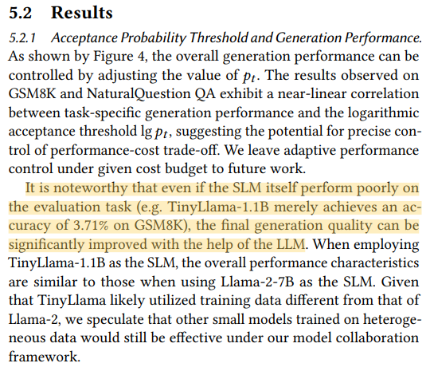
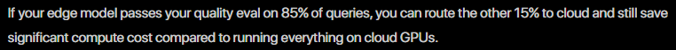

## Edge-Cloud Archtiecture Week3

 Edge-Cloud AI Agent Collaboration Inferenece

### 1. AI Agent 정의와 구성 요소

- AI Agent란: Task에 대해 환경을 인식하고 판단, 행동하여 자율적으로 목표를 수행하는 시스템. 기존 LLM이 단일 프롬프트에 대한 응답 생성을 한다면, AI Agent는 목표 달성을 위해 추론과 행동을 반복적으로 수행함.

- Agent의 동작 원리: Perception(인지) -> Reasoning(추론) -> Action(행동) -> Observation(관측) 을 반복하여(ReAct 패턴) Task를 완료할때까지 반복
  - Perception: 사용자 입력 파싱, 의도 분류. 멀티모달 입력 처리.
  - Reasoning: 현재 상태 기반으로 다음 행동 결정. SLM(Edge) vs. LLM(Cloud) 추론 엔진.
  - Action: Tool Use, Function Calling, API Call 등 외부 도구 실행. 또는 최종 응답 생성.
  - Observation: 행동 결과 관측 후, 목표 달성 여부를 판단. 미완료시 다음 추론 사이클 진행.

  - Memory
    - Short-term Memory: 현재 대화 세션의 히스토리, Context Window 관리
    - Long-term Memory: 이전 세션 정보, 사용자 정보 등 저장

### 2. Edge-Cloud 에서의 AI Agent

- 목적: Cloud-only Agent는 Latency(추론 시마다 호출), Cost(토큰당 과금), Privacy 문제가 존재하며, Edge-only Agent는 추론 능력의 한계와 할루시네이션 제어의 어려움이 존재함.

- Edge-Cloud Agent Collaboration 가치
- 연구 결과 1: Token-level 협업에서 전체 토큰 중 3%만 Cloud LLM이 생성해도 동일한 품질 달성 가능. 이는 대부분 토큰이 SLM으로도 충분히 예측가능한 쉬운 토큰이며, LLM이 필요한 어려운 토큰은 소수에 불과함을 의미.

- 연구 결과 2: Task-level 라우팅으로 85% 트래픽을 Edge에서 처리하면 Cloud 비용 60~80% 절감 가능.

### 3. 핵심 Collaboration 패턴

- Task-level Collaboration: Request Routing
  - 개념: 사용자 요청(Task) 전체를 Edge SLM 또는 Cloud LLM 중 하나에 할당하는 방식. 요청이 라우터를 거치며, 해당 요청의 난이도와 특성 기반으로 최적 실행 위치 결정.
  - 판단 기준: 토큰 수, PII(Personal Identifiable Information), Task 유형
  - 장점: 판단이 빠르고, 구현이 단순.
  - 단점: 이분법적 판단으로 gray-zone에서 비효율 발생.
  - 대표 연구: CE-CoLLM

- Token-level Collaboration: Speculative Decoding
  - 개념: Edge SLM이 Draft 토큰 생성하고, Cloud LLM 이 병렬 검증.
  - 핵심 지표: Acceptance Rate - SLM이 생성한 Draft 토큰을 Cloud LLM이 수용하는 비율.
  - 장점: 학습 없이 적용 가능. 최종 출력에는 LLM 품질이 보장됨.
  - 단점: Acceptance Rate가 낮은 Task에 대해서는 통신 오버헤드 증가.
  - 대표 연구: PicoSpec, FlexSpec

- Tool-level Edge Agent Tool Use
  - 개념: Agent의 Action 단계에서 호출하는 도구를 실행 위치에 따라 Edge와 Cloud로 분리. Edge Agent가 로컬 도구 (디바이스 제어 레벨)를 직접 호출, Cloud Agent는 복잡한 도구 (외부 API 등)
  - 장점: 로컬 도구 호출 시 네트워크 지연 없음. 보안 민감 데이터를 Edge에서 실행 가능.
  - 단점: Edge Agent의 Function Call 정확도가 낮을 수 있음.
  - 대표 연구: TinyAgent, NetGPT

### 4. 비즈니스/도메인

- 모바일 디바이스에서 동작하는 대화형 AI Assitance (스마트폰 챗봇, 매장 키오스크 등 사용자와 Interaction)

- 선정 기준:
  - Task 내 단순 응답부터 복합 분석 요청까지 존재함
  - 다양한 Tool 호출 시나리오
  - 보안 민감 데이터 포함
  - N/W 불안정 시나리오 존재
  - CX를 위한 Latency 고려 필요
    -  Latency: Network round-trip = 20-80ms
      - Voice AI: 150ms 이하로 응답
      - Interactive Chat: 500ms 이하로 응답

- 대표 레퍼런스:
  - 연구: CE-CoLLM, PicoSpec, TinyAgent, NetGPT
  - 산업: 알리바바 Walle, Google AI Edge

- CE-CoLLM

- PicoSpec

- TinyAgent

- 알리바바 Walle

- Google AI Edge
Function Gemma 모델

[Reference]
Hao, Zixu, et al. "Hybrid slm and llm for edge-cloud collaborative inference." Proceedings of the Workshop on Edge and Mobile Foundation Models. 2024.

(AI Inference Guide) [https://www.spheron.network/blog/hybrid-cloud-edge-ai-inference-guide/]